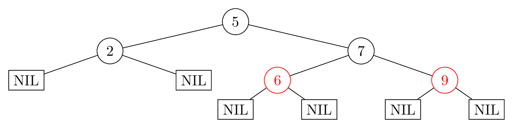

# Disclaimer
Dies ist eine _inoffizielle_ Mitschrift aus der Vorlesung zu Algorithmen & Datenstrukturen von Prof. Dr. Christian Sohler. Ich habe Prof. Sohler's Erlaubnis, dies zu publizieren. Dies bedeutet jedoch nicht, dass irgendjemand Korrekturgelesen hätte. Fehler, Ungenauigkeiten etc. sind demnach zu erwarten und mir zuzuschreiben.

# 1. Definitionen
## Informatik
Informatik ist die Disziplin der automatischen Verarbeitung von Information.[^11]

[^11]: https://gi.de/fileadmin/GI/Hauptseite/Themen/was-ist-informatik-kurz.pdf

## Algorithmus
Ein Algorithmus ist eine wohldefinierte Handlungsvorschrift, die einen Wert oder eine Menge von Werten als Eingabe erhält und als Ausgabe einen Wert oder eine Menge von Werten liefert.[^12]

[^12]: [@AlgorithmsCormen2022]

## Datenstruktur
Eine Datenstruktur ist eine Anordnung von Daten im Speicher eines Rechners, die effizienten Zugriff auf die Daten ermöglicht.

Es gibt verschiedene Anforderungen. Im Allgemeinen sind die Suche eines bestimmten Wertes, das Speichern eines neuen Datensatzes und das Löschen eines bestehenden Datensatzes wichtige Anforderungen. Oft kann nicht jede dieser Anforderungen gleich effizient gewährleistet werden.

Deswegen können Datenstrukturen bezüglich ihres Speicherbedarfs und der Laufzeit von Algorithmen, die auf ihnen ausgeführt werde, bewertet werden.

## Lernziele
* Methoden zur Entwicklung von Algorithmen
* Bewertung der Qualität von Algorithmen
    * Korrektheit
    * Ressourcen, insbesondere Laufzeit
* Lernen grundlegender Algorithmen und Datenstrukturen

# 2. Entwicklung von Algorithmen
## Methode: Teile und Herrsche
1. Teile die Eingabe in mehrere gleich große Teile auf.
2. Löse das Problem rekursiv auf den einzelnen Teilen.
3. Füge die Teile zu einer Lösung des Gesamtproblems zusammen.

Diese Algorithmen sind oft für teilbare Daten geeignet, beispielsweise für Felder und geometrische Daten.

### Beispiele
* MergeSort
* BinäreSuche
* $n$-Ziffer-Integer Multiplikation
* Matrixmultiplikation (Algorithmus von Strassen)

### Unterscheidungen
Teile-und-Herrsche-Algorithmen unterscheiden sich durch...
* die Anzahl der Teilprobleme.
* die Größe der Teilprobleme.
* den Algorithmus für das Zusammensetzen der Teilprobleme.
* den Rekursionsabbruch.

### Laufzeit
Die Laufzeit kann durch eine Laufzeitanalyse vorhergesagt werden:

* $T(1) \in \mathcal O(1)$
* $T(n) = a T(\frac{n}{b}) + f(n)$
    * $a$: Anzahl der Teilprobleme
    * $b$: Größe der Teilprobleme, bestimmt die Höhe des Rekursionsbaums
    * $f(n)$: Aufwand für Aufteilen und Zusammenfügen

## Methode: Dynamische Programmierung
* Beschreibe optimale Lösung einer gegebenen Instanz durch optimale
Lösungen „kleinerer“ Instanzen.
* Beschreibe Rekursionsabbruch.
* Löse die Rekursion "bottom-up" durch schrittweises Ausfüllen einer Tabelle der benötigten Teillösungen.

Dies ist schneller als die rekursive Methode, wenn
1. die "Rekursionstiefe" klein ist.
2. die normale Rekursion viele Mehrfachausführungen hat.

Hinweise:
* Wenn wir es mit Mengen zu tun haben, können wir eine Ordnung der Elemente einführen und die Rekursion durch Zurückführen der optimalen Lösung für $i$ Elemente auf die Lösung für $i-1$ Elemente erhalten.
* Benötigt wird dabei der Wert der optimalen Lösung für $i-1$ Elemente.
* Die Lösung selbst kann nachher aus der Tabelle rekonstruiert werden.

Dynamische Programmierung kann genutzt werden, um Optimierungsprobleme zu lösen.

### Beispiele
* Fibbonacci-Zahlen
* SearchMax (keine Laufzeitverkürzung möglich)
* Rucksackproblem

## Methode: Gierige Algorithmen
Gierige Algorithmen sind dazu gedacht, Optimierungsprobleme zu lösen. Sie lösen das Problem schrittweise, wobei bei jedem Schritt ein lokales Kriterium optimiert wird.

Üblicherweise sind diese Algorithmen einfach zu implementieren. Die Korrektheit sicherzustellen ist dagegen schwieriger. Da immer ein lokales Kriterium optimiert wird, ist nicht sichergestellt, dass das globale Kriterium dabei optimal werden kann. Es kann also sein, dass keine oder eine suboptimale Lösung gefunden wird.

Manchmal kann eine optimale Lösung gefunden werden, manchmal kann aber nur eine approximative Lösung gefunden werden. Üblicherweise lassen sich diese Algorithmen in polynomieller Laufzeit implementieren.

Eine Idee zum Entwickeln kann sein, nur bestimmte Ereignisse zu überprüfen. Beispielsweise bei der Verteilung von (Zeit-)Intervallen sind nur die Zeitpunkte betrachten, zu denen mindestens ein Interval beginnt oder endet.

### Beweise
Zu einem bestimmten Zeitpunkt im Algorithmus muss gezeigt werden, dass der gierige Algorithmus mindestens so gut wie die optimale Lösung ist.

### Beispiele

* Wechselgeldrückgabe
* IntervalScheduling
* LatenessScheduling: Interval-Scheduling mit Deadlines

## Rekursion
Eine rekursive Methode ruft sich selbst mit veränderten Parametern auf. Hierzu ist zu Beginn der Methode eine Abbruchbedingung notwendig, die den einfachsten Fall des Problems löst. Ansonsten kommt es zu einer Endlosrekursion.

Zur Entwicklung von neuen Algorithmen ist Rekursion oft hilfreich, wenn man ein Problem auf eine kleinere Stufe desselben Problems runterbrechen kann. Allerdings sind manche rekursive Methoden ineffizient,[^21] daher sollte ein solcher Algorithmus oft verbessert / angepasst werden.

[^21]: Beispielsweise die Berechnung von Fibbonacci-Zahlen ist rekursiv extrem ineffizient, so lange keine Ergebnisse zwischengespeichert werden.

### Laufzeit
Die Laufzeit kann durch eine Laufzeitanalyse vorhergesagt werden.

* $T(1) \in \mathcal O(1)$
* $T(n) = a T(\frac{n}{b}) + f(n)$
    * $a$: Anzahl der Teilprobleme
    * $n/b$: Größe der Teilprobleme, bestimmt die Höhe des Rekursionsbaums
    * $f(n)$: Aufwand für Aufteilen und Zusammenfügen
* Die Laufzeit beträgt normalerweise $T(n)\in\mathcal O(f(n)\cdot\log_b(n))$
    * $\log_b(n)$ ist die Höhe des Rekursionsbaums
    * meistens ist $b=2$, also gilt meist $T(n)\in\mathcal O(f(n)\cdot\log_2(n))$
    * Auf der letzten Rekursionsstufe gibt es $n$ Teilprobleme der Größe $1$. Es gilt $b^h=n$, wobei $h=\log_b{n}$ die Rekursionshöhe beschreibt.

## Optimierung
### Kostenfunktion
Für eine Eingabe $I$ sei $S(I)$ die Menge der möglichen Lösungen. Für $L\in S(I)$ sei $\mathrm{cost}(L)$ eine _Kostenfunktion_. Gesucht ist nun die Lösung $L$ mit minimalen Kosten $\mathrm{cost}(L)$.

Alternativ zu dieser Methode kann man auch eine _Wertefunktion_ maximieren.

# 3. wichtige Algorithmen
## Rekursionsalgorithmen
### Insertion Sort
```
InsertionSort(A, n) \\ Feld A der Länge n wird übergeben
    for i=2 to n do
        x = A[i]
        j = i - 1
        while j>0 and A[j]>x do
            A[j+1] = A[j]
            j = j - 1
        A[j+1] = x
```

Die Worst-Case-Laufzeit von InsertionSort ist $\Theta(n^2)$.

#### deskriptiver Pseudocode
```
InsertionSort(A, n) \\ Feld A der Länge n wird übergeben
    if n=1 return \\ n=1 ist sortiert
    x = A[n] \\ speichere das letzte Element
    InsertionSort(A,n-1) \\ sortiere das Feld bis n-1
    Füge x an die korrekte Stelle in A ein
```

### Merge Sort
$\mathrm{MergeSort}$ sortiert erst beide Hälften eines Feldes seperat, bevor es sie zusammenfügt. Dadurch wird das Feld rekursiv sortiert.

* Erster Aufruf: $\mathrm{MergeSort}(A,1,n)$ mit einem Feld $A$ der Länge $n$.
* Worst-Case-Laufzeit: $T(n) \le \begin{cases} 1 \Leftrightarrow n=1\\ 2T(\frac{n}{2}) + n: \text{sonst}\end{cases}\Rightarrow T(n) = \mathcal O(n\log_2 n)$

Satz: Der Algorithmus $\mathrm{MergeSort}(A,p,r)$ sortiert das Feld $A[p..r]$ korrekt.
Satz: Der Algorithmus $\mathrm{MergeSort}(A,1,n)$ hat eine Laufzeit von $\mathcal O(n \log_2 n)$.

#### deskriptiver Pseudocode
```
MergeSort(A,p,r) \\ Sortiert A[p..r]
    if p<r then \\ Rekursionsabbruch, wenn p=r
        int q = (p+r)/2 \\ Berechne die Mitte (Gaußklammer)
        MergeSort(A,p,q) \\ Sortiere linke Teilhälfte
        MergeSort(A,q+1,r) \\ Sortiere rechte Teilhälfte
        Merge(A,p,q,r) \\ Füge die Teile zusammen
```

### BinarySearch
$\mathrm{BinarySearch}$ sucht erst in beiden Hälften eines Feldes seperat, die Ergebnisse vergleicht. Dadurch wird das Feld rekursiv durchsucht.

Satz: Die Laufzeit von $\mathrm{BinäreSuche}(A,x,p,r)$ ist $\mathcal O(\log_2 n)$, wobei $n= r-p+1$ die Größe des zu durchsuchenden Bereichs ist.
Satz: Der Algorithmus $\mathrm{BinäreSuche}(A,x,p,r)$ findet den Index einer Zahl $x$ in einem sortierten Feld $A[p..r]$, sofern $x$ in $A[p..r]$ vorhanden ist.

#### deskriptiver Pseudocode
```
BinarySearch(A,x,p,r) \\ Finde Zahl x in sortiertem Feld A[p..r]
    if p=r then return p \\ sofern vorhanden
    else \\ Ausgabe: Index der gesuchten Zahl
    int q = (p+r)/2 \\ Berechne die Mitte (Gaußklammer)
    if x <= A[q] then return BinarySearch(A,x,p,q)
    else return BinarySearch(A,x,q+1,r)
```

### $n$-Ziffer-Integer Multiplikation
Für große Zahlen wird angenommen, dass jede Ziffer eine Speicherzelle benötigt. Zwei $n$-Ziffer-Zahlen kann in der Laufzeit $\Theta(n)$ berechnet werden. Eine $n$-Ziffer kann in Laufzeit $\Theta(n+k)$ mit $10^k$ multipliziert werden.

Dazu wird wie bei der schriftlichen Multiplikation vorgegangen, wobei $A,B,C,D$ $n$-Ziffern sind. $AB\cdot CD = 100AC + 10(AD + BC) + BD$. Dies sind $4$ Multiplikationen von $n$-Ziffern. Die Laufzeit ist allerdings $T(n)=4T(\frac{n}{2})+cn \in \Theta(n^2)$.

Effizienter wird die Multiplikation, wenn die Identität $(A+B)(C+D)=AC+BC+AD+BD$ verwendet wird. Damit kann die Summe $BC+AD$ durch $(A+B)(C+D)-AC-BD$ ausgedrückt werden, die Werte $AC$ und $BD$ müssen ohnehin berechnet werden. Dadurch kann man sich eine Multiplikation sparen und man erhält die Laufzeit von $T(n)=3T(\frac{n}{2})+cn \in \Theta(n)$.

### Algorithmus von Strassen (Matrixmultiplikation)
Mithilfe des Algorithmus von Strassen kann das Produkt zweier $n\times n$-Matrizen rekursiv in der Worst-Case-Laufzeit $\mathcal O(n^2)$ berechnet werden.

Dazu kann jede $n\times n$-Matrix in $4$ Teilmatrizen der Größe $\frac{n}{2}\times\frac{n}{2}$ aufteilen. Dann werden $8$ $\frac{n}{2}\times\frac{n}{2}$-Matrizen multipliziert und $4$ $\frac{n}{2}\times\frac{n}{2}$-Matrizen addiert.

$$
    \begin{pmatrix}A&B\\C&D\end{pmatrix}
        \cdot \begin{pmatrix}E&F\\ G&H\end{pmatrix}
        =
            \begin{pmatrix}
                AE + BG & AF + BH \\
                CE + DG & CF + DH \\
            \end{pmatrix}
$$

Mit dieser simplen Methode ist die Laufzeit $T(n)\in \mathcal O(n^{\log_2 8})\subseteq\mathcal O(n^3)$.

$$
    T(n) =
        \begin{cases}
            c & n=1 \\
            8T(\frac{n}{2}) + cn^2 & n>1
        \end{cases}
$$


Es können einige Relationen verwendet werden, um die Multiplikation einer $\frac{n}{2}\times\frac{n}{2}$-Matrix zu sparen.

* $P_1 = A (F-H)$
* $P_2= (A+B)H$
* $P_3 = (C+D)E$
* $P_4 = D(G-E)$
* $P_5 = (A+D)(E+H)$
* $P_6 =(B-D)(G+H)$
* $P_7 = (A-C)(E+F)$
* $AE + BG = P_4 + P_5 + P_6 – P_2$
* $AF + BH = P_1 + P_2$
* $AF + BH = P_1 + P_2$
* $AF + BH = P_1 + P_5 – P_3 – P_7$

Auf diese Weise kann das Produkt zweier $n\times n$-Matrizen in der Laufzeit $\mathcal O(n^{\log_2 7})\subseteq\mathcal O(n^2)$ berechnet werden.

## Dynamische Programmierung
### Fibbonacci-Zahlen
#### primitiver rekursiver Algorithmus
```
FibRecursive(n)
    if n=1 then return 1
    if n=2 then return 1
    return Fib2(n-1) + Fib2(n-2)
```

$\mathrm{FibRecursive}$ hat eine Laufzeit von $T(n)\in\Omega(2^n)$, da für jede Rekursionsebene $2$-mal der komplette Rekursionsbaum aufgerufen werden muss. Beispielsweise wird $\mathrm{FibRecursive}(6)$ dreimal $\mathrm{FibRecursive}(3)$ aufrufen.

$$
    T(n) =
        \begin{cases}
            2 & n=1 \\
            3 & n=2 \\
            T(n-1) + T(n-2) + 1 & n>2
        \end{cases}
$$

#### dynamischer Algorithmus
Ein besserer Algorithmus speichert Zwischenergebnisse, um doppelte Berechnungen zu vermeiden. Dies gehört zur Dynamischen Programmierung.

Für jedes $m>0$ gilt, dass $\mathrm{FibDynamicCalc}(m)$ maximal zweimal aufgerufen wird. Daher ist die Laufzeit von $\mathrm{FibDynamic}(n)$ linear $T(n)\in\mathcal O(n)$.

```
FibDynamic(n)
    F = new array [1..n]
    for i=1 to n do
        F[i]=0
    F[1] = 1
    F[2] = 1

    return FibDynamicCalc(F, n)

FibDynamicCalc(F, n)
    if F[n] > 0 then return F[n]
    else
        F[n] = FibDynamicCalc(F,n-1) + FibDynamicCalc(F,n-2)
    return F[n]
```

Vereinfacht:
```
Fib1(n)
    F = new array[1..n]
    F[1] = 1
    F[2] = 1
    for i=3 to n do
        F[i] = F[i-1] + F[i-2]
    return F[n]
```

### SearchMax
Suche das Maximum der Werte in einem Feld $A$ der Länge $n$. In diesem Fall bringt die Dynamisch Programmierung keine Laufzeitverkürzung.

#### rekursiv
Rekursiver Algorithmus.
```
SearchMaxRecursive(A, n)
    if n=1 then return A[1]
    prev_max = SearchMaxRecursive(A, n-1)
    return max{prev_max, A[n]}
```

#### dynamisch
Algorithmus nach Dynamischer Programmierung.
```
MaxSucheDP(A,n)
    Max = new array [1...n]
    Max[1] = A[1]
    for i=2 to n do
        Max[i] = max{Max[i-1], A[i]}
    return Max[n]
```

### Partition
Sei eine Menge natürlicher Zahlen $M\subset \mathbb N$ gegeben. Nun soll festgestellt werden, ob $M$ in zwei Mengen $L,R$ aufgeteilt werden kann, sodass die Summe aller Elemente in den Teilmengen gleich ist.

$$
    \sum_{x\in L} x = \sum_{y\in R} y
$$

* Das Partitionsproblem ist $NP$-vollständig.
* Die Frage, ob man Partition in _polynomieller_ Laufzeit lösen kann, ist äquivalent zur Frage ob $P$ gleich $NP$ ist.
* Sei $W=\sum_{x\in M} x$, so kann man die zwei Teilmengen $L,R$ genau dann finden, wenn es eine Teilmenge $L$ mit $\sum_{x\in L} x=\frac{W}{2}$ gibt.

### SubsetSum
$\mathrm{SubsetSum}$ löst eine verallgemeinerte Fragestellung aus der Partitionsfrage.
Gibt es für ein gegebenes $U$ eine Teilmenge $L\subseteq M$, für die $U=\sum_{x\in L} x$ gilt?

* Sei $M=\{x_1, \dots, x_n\}$ eine Menge, deren Elemente eine Reihenfolge haben.
* Definiere Indikatorfunktion $\mathrm{Ind}(U,m)$.

#### Entwicklung des Algorithmus
1. Sei $x_n\in L$
    * Es gilt $L=\{x_n\} \cup L\backslash \{x_n\}$.
    * Sei $U^\prime=U-x_n$
    * Gesucht wird eine Menge $L^\prime\subseteq L\backslash \{x_n\}: U^\prime=\sum_{x\in L} x$
2. Sei $x_n\notin L$
    * Gesucht wird eine Menge $L^\prime\subseteq L\backslash \{x_n\}: U=\sum_{x\in L} x$

#### Indikatorfunktion
$$
    \mathrm{Ind}(U,m) =
        \begin{cases}
            \mathrm{true} & \exists L\subseteq M: U=\sum_{x\in L} x \\
            \mathrm{false} & \nexists L\subseteq M: U=\sum_{x\in L} x
        \end{cases}
$$

#### Rekursive Beschreibung
```
Ind(A, U, m)
    if n=1
    then
        if U>0 \\ Ind(0, 1)
        then return true
        else \\ Ind(U, 1)
        if A[1]=U
        then return true
        else return false
    if U>=x and Ind(A, U-x, n-1) = true then return true
    return Ind(A, U, n-1)
```

#### Pseudocode
```
SubsetSum(A, U, n)
    \\ initalisiere Indikator
    Ind = new array [0..U][1..n]
    for j=1 to U do
        Ind[j,1] = false
    Ind[0,1] = true \\ leere Menge
    if A[1] <= U \\ Menge {A[1]}
    then Ind[A[1],1] = true

    \\ suche nach Teilmenge
    for i=2 to n do
        for u=0 to U do
            Ind[u,i] = false
            if Ind[u,i-1] = true then Ind[u,i] = true
            if u>=A[i] und Ind[u-A[i], i-1] = true
            then Ind[u,i] = true
    return Ind[U,n]
```

$\mathrm{SubsetSum}(A, U, n)$ hat eine Laufzeit von $T(n)=\mathcal O(nU)$.

#### Korrektheitsbeweis
Der Korrektheitsbeweis nutzt die Schleifeninvariante $\mathrm{Ind}[u,i]=\mathrm{true}$ genau dann, wenn es eine Teilmenge der ersten $i$ Zahlen aus $A$ gibt, die sich zu $u$ aufsummieren.

## Optimierungsprobleme
### Rucksackproblem
Es gibt einen Rucksack mit begrenzter Kapazität, in den Objekte mit verschiedenen Größen und verschiedenen Werten gepackt werden sollen. Ziel ist es, den Rucksack mit dem größtmöglichen Wert zu befüllen.

Dazu hat man eine Menge $M=\{1,\dots,n\}$ an Objekten, die jeweils eine Größe und einen Wert haben. Dies kann man auch durch getrennte Felder für die Werte $w_i$, die Gewichte $g_i$ und die Rucksackgröße $G$ darstellen.

Dies ist ein Optimierungsproblem.[^31]

[^31]: siehe Kapitel _Optimierungsprobleme_

### Wechselgeldrückgabe
Ein eingegebener Centbetrag soll mit möglichst wenig Münzen zurückgegeben werden. Dies wird mit einem gierigen Algorithmus gelöst.

Sei $B$ der Centbetrag. Ein gieriger Algorithmus wählt zunächst die größte verfügbare Münze $M$ mit $M\le B$ aus und sucht die optimale Rückgabe für den Restbetrag $B-M$.

#### Korrektheit
Angenommen, die Menge der Münzen sei $\{50, 10, 5, 1\}$, dann funktioniert der Algorithmus.

Falls die Menge der Münzen aber $\{50, 10, 7, 5, 1\}$ ist, löst der Algorithmus das Problem nicht: Sei $B=14$, so liefert der Algorithmus $(1\times 10, 4\times 1)$ als Ergebnis. Die optimale Lösung wäre aber $(2\times 7)$.

### Interval-Scheduling
Ziel ist es, eine Ressource möglichst effektiv zu nutzen. Dies bedeutet, dass die Ressource möglichst wenig genutzt wird oder immer möglichst schnell wieder freigegeben wird.

#### Notation
Sei die Eingabe eine Menge von Intervallen. In Pseudocode kann dies durch die Anzahl $n$, sowie Felder mit den Anfangswerten $A$ und den Endwerten $E$ dargestellt werden.

Gesucht sei die Menge $S\subseteq \{1,\dots,n\}$, sodass die Anzahl der Elemente maximiert wird, wenn sich die verschiedenen Intervalle nicht überlappen. $\forall i \in S: \exists i\neq j\in S: E[i]\le A[j] \lor E[j]\le A[i]$.

#### Kompatible Intervalle
Zwei Intervalle heißen kompatibel, wenn sie sich nicht teilweise überlappen. D.h. mit Feldern der Anfangswerte $A$ und Feldern der Endwerte $E$ gilt $\forall i \in S: \exists i\neq j\in S: E[i]\le A[j] \lor E[j]\le A[i]$.

#### Gieriger Algorithmus
1. Wähle ein Interval $i_j$ geschickt und füge es in die Ergebnismenge $S$ ein.
2. Entferne alle Intervalle, die nicht mit $i_j$ kompatibel sind.
3. Gehe zu $1$.

Die Schwierigkeit liegt in Schritt $1$. Sowohl die Wahl des erstmöglichen Intervals als auch die Wahl des kürzesten Intervals liefert nicht immer das gewünschte Ergebnis. Da die Ressource immer möglichst früh freigegeben werden soll, kann man immer das Interval nehmen, das am frühesten endet.

Der Algorithmus $\mathrm{IntervalSchedule}$ berechnet in Laufzeit $\mathcal O(n)$ eine optimale Lösung, wenn die Eingabe nach Endzeit der Intervalle sortiert ist. Die Sortierung kann in $\mathcal O(n \log n)$ Zeit berechnet werden.

```
\\ Voraussetzung: Die Intervalle sind nach Endzeitpunkt sortiert.
IntervalScheduling(A,E,n)
    S = {1}
    j = 1
    for i=2 to n do
        if A[i] >= E[j] then
            S = S + {i} \\ Vereinigungsmenge
            j = i
    return S
```

### Interval-Scheduling mit Deadlines
Wie beim Interval-Scheduling soll eine Ressource bestmöglich genutzt werden. Im Unterschied zu den dortigen Bedingungen sollen hier aber bestimmte Aufgaben gelöst werden, die die Ressource für eine gewisse Dauer in Anspruch nehmen. Zudem hat jede Aufgabe eine Deadline, zu der sie erfüllt sein soll.

Wird eine Aufgabe $z$ Zeiteinheiten nach der Deadline erfüllt, hat sie eine Verzögerung von $z$. Wird eine Aufgabe innerhalb der Deadline beendet, hat sie eine Verzögerung von $0$.

In diesem Fall wird so optimiert, dass die maximale Verzögerung minimiert wird. Hierzu müssen die Aufgaben in der Reihenfolge ihrer Deadlines bearbeitet werden.

#### Notation
Sei die Eingabe eine Menge von Intervallen. In Pseudocode kann dies durch die Anzahl $n$, sowie Felder mit den Laufzeiten $t$ und den Deadlines $d$.

Es sollen die Startzeitpunkte der jeweiligen Aufgaben zurückgegeben werden.

#### Pseudocode
Unter der Annahme, dass die Aufgaben in Reihenfolge ihrer Deadlines nicht-absteigend sortiert sind, löst der folgende Algorithmus das Problem in Laufzeit $T(n)\in\mathcal O(n)$ optimal und ohne Leerlauf.

```
LatenessScheduling(t,d,n)
    A = new array [1..n]
    z=0
    for i=1 to n do
        A[i] = z
        z = z + t[i]
    return A
```

#### Leerlauf
Alle Lösungen ohne Leerlauf, bei denen die Aufgaben nicht-absteigend nach Deadline sortiert sind, haben dieselbe maximale Verzögerung. Es gibt immer eine optimale Lösung ohne Leerlauf, bei der die Aufgaben nicht-absteigend nach Deadline sortiert sind.

#### Inversion
Eine Reihenfolge von Aufgaben hat eine Inversion $(i,j)$, wenn Aufgabe $i$ vor Aufgabe $j$ in der Reihenfolge auftritt, aber die Deadline $d[i]$ von Aufgabe $i$ größer ist als die Deadline $d[j]$ von Aufgabe $j$.

Eine Reihenfolge ohne Inversionen ist nicht-absteigend sortiert.

Gibt es in einer Reihenfolge von Aufgaben eine Inversion $(i,j)$, dann gibt es auch eine Inversion zweier in der Reihenfolge benachbarter Aufgaben und man kann Aufgabe $i$ und $j$ vertauschen, ohne die Lösung zu verschlechtern.

## Suchbaumalgorithmen
### Binäre Suchbäume
#### Inorder-Tree-Walk
Sei $x$ ein binärer Suchbaum. Dann gibt diese Prozedur den kompletten Baum in aufsteigender Reihenfolge in Laufzeit $\mathcal O(n)$ aus.

```
Inorder-Tree-Walk(x)
    if x=NIL then return \\ kein Baum
    Inorder-Tree-Walk(left[x])
    Ausgabe key[x]
    Inorder-Tree-Walk(right[x])
```

#### BinaryTreeSearch
Sei $x$ ein binärer Suchbaum der Höhe $h$. Dann gibt $\mathrm{BinaryTreeSearch}(x,k)$ den Knoten mit dem Schlüssel $k$ aus, falls dieser in dem Baum $x$ enthalten ist. Ansonsten gibt die Funktion $\mathrm{NIL}$ zurück, dies benötigt die Worst-Case-Laufzeit $\mathcal O(h)$ aus.

```
BinaryTreeSearch(x,k)
    if x=NIL or k=key[x] then return x
    if k<key[x] then return BinaryTreeSearch(left[x],k)
    else return BinaryTreeSearch(right[x],k)
```

#### MinSearch / MaxSearch
Sei $x$ ein binärer Suchbaum der Höhe $h$, dann können der minimale und der maximale Schlüssel in Worst-Case-Laufzeit $\mathcal O(h)$ gefunden werden.

```
MinSearch(x)
    while left[x] != NIL do
        x = left[x]
    return x
```

#### FollowerSearch
$\mathrm{FollowerSearch}(x)$ sucht den Nachfolgerknoten in einem binären Suchbaum der Höhe $h$ in der Worst-Case-Laufzeit $\mathcal O(h)$. Nachfolger bedeutet, dass $x$ den nächstgrößten Schlüssel besitzt. Analog kann der Vorg

1. Falls es einen rechten Unterbaum gibt, ist der am weitesten links liegende Knoten der Nachfolger.
2. Ansonsten ist der Nachfolger der erste Elternknoten, dessen Schlüssel größer als der von $x$ ist. Gibt es keinen solchen Knoten, dann hat $x$ den größten Schlüssel.

```
FollowerSearch(x)
    if right[x] != NIL \\ es gibt einen rechten Unterbaum
    then
        \\ der Knoten mit dem kleinsten Wert ist der Nachfolger
        return MinSearch(right[x])

    y = parent[x]
    while y != NIL and x = right[y] do
        x = y
        y = parent[y]
    return y
```

#### Save
Um einen neuen Schlüssel $k$ in einem binären Suchbaum $T$ der Höhe $h$ zu speichern, muss der Blattknoten gefunden werden, an den der neue Knoten angehängt wird. Daraufhin wird ein neuer Knoten als Unterbaum abgespeichert. Da dies konstante Laufzeit erfordert, benötigt der Speichervorgang die Laufzeit $O(h)$, die durch die Suche des Blattknotens mittels $\mathrm{FollowerSearch}(x)$ entsteht.

```
Save(T,k)
    \\ create new node
    z = new node
    key[z] = k
    right[z] = NIL
    left[z] = NIL

    \\ find future parent node
    y = NIL
    x = root[T]
    while x != NIL do
        y=x
        if k < key[x]
        then x = left[x]
        else x = right[x]

    parent[z] = y

    if y=NIL
    then root[T] = z
    else
        if key[z] < key[y]
        then left[y] = z
        else right[y] = z
```

#### Delete
Beim Löschen eines Knotens $z$ aus einem binären Suchbaum $T$ der Höhe $h$ muss der Baum wieder korrekt zusammengebaut werden. Dies funktioniert nur in der Worst-Case-Laufzeit $\mathcal O(h)$.

1. Wenn $z$ keine Kinder hat, kann $z$ einfach entfernt werden.
2. Wenn $z$ ein Kind hat, dann wird $z$ mit seinem Kind ersetzt.
3. Wenn $z$ zwei Kinder hat, dann muss es mit seinem Nachfolger $y$ ersetzt werden. Dazu muss der Schlüssel $\mathrm{key}[z]$ auf den des Nachfolgers $\mathrm{key}[y]$ gesetzt werden, woraufhin der Nachfolger $y$ entfernt werden kann.

```
Löschen(T,z)
    if left[z]=NIL or right[z]=NIL then y=z
    else y = FollowerSearch(z)

    if left[y]=NIL
    then x = right[y]
    else x = left[y]

    if x != NIL
    then parent[x]=parent[y]

    if parent[y]=NIL
    then root[T]=x
    else
        if y = left[parent[y]]
        then left[parent[y]]=x
        else right[parent[y]]=x

    key[z]=key[y]
    delete y
```

### Rot-Schwarz-Bäume
#### Linksrotation
Sei $p$ ein Knoten in einem Rot-Schwarz-Baum mit $\mathrm{left}[p]=l$ und $\mathrm{right}[p]=r$. Eine Linksrotation verschiebt die Struktur nach links, sodass $r$ die Position von $p$ einnimmt und $p=\mathrm{left}[r]$ wird. Die Rotation läuft gegen den Uhrzeigersinn.

```
Linksrotation(T,x)
    y = right[x]
    right[x] = left[y]

    if left[y]!=NIL then parent[left[y]] = x

    parent[y] = parent[x]

    if parent[x]=NIL
    then root[T] = y
    else
        if x=left[parent[x]]
        then left[parent[x]] = y
        else right[parent[x]] = y

    left[y] = x
    parent[x] = y
```

#### RS-Einfügen
Beim Einfügen in einen Rot-Schwarz-Baum muss zunächst ein neuer Knoten eingefügt werden. Daraufhin muss die Baumstruktur repariert werden, sodass die Rot-Schwarz-Eigenschaft wieder erfüllt sind. So lange diese Reparatur maximal die Laufzeit $\mathcal O(\log_2n)$ benötigt, läuft der gesamte Algorithmus in der Laufzeit $T(n)\in\mathcal O(\log_2n)$.

```
RSEinfügen(T,k)
    \\ Initialisiere neuen Knoten
    z = new node
    key[z] = k
    left[z] = NIL[T]
    right[z] = NIL[T]
    color[z] = rot

    \\ Suche Position zum Einfügen
    y = NIL[T]
    x = Root[T]
    while x!=NIL[T] do
        y = x
        if k<key[x]
        then x = left[x]
        else x = right[x]

    \\ Füge Knoten z ein
    parent[z] = y
    if y=NIL[T]
    then root[T] = z
    else
        if k<key[y]
        then left[y] = z
        else right[y] = z

    RS-Einfügen-Fix(T,z) \\ Repariere Baumstruktur
```

#### RS-Einfügen-Fix
Die Struktur des Rot-Schwarz-Baumes $T$ wird nach dem Einfügen eines neuen Knotens $z$ in der Laufzeit $\mathcal O(\log_2n)$ wieder repariert. Nachdem diese Prozedur am Ende der Prozedur $\mathrm{RSEinfügen}(T,z)$ ausgeführt wurde, erfüllt $T$ wieder die Rot-Schwarz-Eigenschaft.

Hierbei wandert die Rot-Markierung des neuen Knotens schrittweise eine Ebene Richtung Wurzel. Wenn diese Markierung an der Wurzel angekommen ist, muss diese noch schwarz gefärbt werden, damit die Rot-Schwarz-Eigenschaft erfüllt ist.

Beim Reparieren soll man folgende Schleifeninvariante gelten.

1. Knoten $z$ ist rot.
2. Wenn $\mathrm{parent}[z]$ die Wurzel ist, dann ist $\mathrm{parent}[z]$ schwarz.
3. Es gibt maximal eine Verletzung der Rot-Schwarz-Eigenschaften:
    1. Ist die Wurzel rot, dann ist $z$ die Wurzel.
    2. Hat ein roter Knoten rote Kinder, dann ist $\mathrm{parent}[z]$ rot.
4. Die Anzahl der schwarzen Knoten auf allen Pfaden von der Wurzel zu jedem Blatt ist gleich.

##### Fallunterscheidung
1. Falls $z$ die Wurzel ist, muss $z$ schwarz gefärbt werden.
2. Der Onkel von $z$ ist rot, ebenso wie der Vater von $z$. Dann muss die rote Ebene um eine Ebene nach oben geschoben werden.
    1. Der Vater und der Onkel von $z$ werden schwarz gefärbt.
    2. Der Großvater von $z$ wird rot gefärbt.
    3. Die Rot-Schwarz-Bedingung muss ausgehend vom Großvater geprüft werden.
4. Der Onkel von $z$ ist schwarz, außerdem sind $z$ und der Vater $\mathrm{parent}(z)$ beide linke bzw. rechte Kinder.
    1. Der Onkel von $z$ wird rot gefärbt.
    2. Rotation um den Großvater von $z$:
        1. $z$ und Vater sind linke Kinder: Rechtsrotaton
        2. $z$ und Vater sind rechte Kinder: Linksrotation
5. Der Onkel von $z$ ist schwarz.
    1. Rotation um den Vaterknoten.
        1. $z$ ist ein rechtes Kind und der Vater ist ein linkes Kind: Linksrotation
        2. $z$ ist ein linkes Kind und der Vater ist ein rechtes Kind: Rechtsrotation
    2. Die Rot-Schwarz-Bedingung muss ausgehend vom Vater geprüft werden.

##### Pseudocode
```
RSEinfügenFix(T,z)
    while color[parent[z]] = rot do
        if parent[z] = left[parent[parent[z]]] then
            y = right[parent[parent[z]]] \\ Onkel von z

            if color[y] = rot then \\ Onkel ist rot
                \\ schiebe rote "Ebene" eine Stufe höher
                color[parent[z]] = schwarz
                color[y] = schwarz
                color[parent[parent[z]]] = rot
                \\ prüfe beim Großvater weiter
                z = parent[parent[z]]
            else \\ Onkel schwarz
                if z = right[parent[z]] then
                    \\ parent[z] rechter Knoten
                    Linksrotation(T, parent[z])
                    \\ prüfe beim Vater weiter
                    z = parent[z]
                else \\ z und parent[z] linke Knoten
                    color[parent[z]] = schwarz
                    color[parent[parent[z]]] = rot
                    Rechtsrotation(T, parent[parent[z]])
        else
            \\ analog
    color[root[T]] = schwarz
```

#### RS-Löschen
Der Prozedur wird ein Knoten $z$ übergeben, die aus dem Baum $T$ gelöscht werden soll. Das Löschen erfolgt wie beim allgemeinen binären Suchbaum. Danach muss der Baum repariert werden, falls die Rot-Schwarz-Eigenschaft nicht mehr gilt. Das Löschen erfolgt in Laufzeit $\mathcal O(\log_2n)$.

1. Wenn $z$ keine Kinder hat, kann $z$ einfach entfernt werden.
2. Wenn $z$ ein Kind hat, dann wird $z$ mit seinem Kind ersetzt.
3. Wenn $z$ zwei Kinder hat, dann muss es mit seinem Nachfolger $y$ ersetzt werden. Dazu muss der Schlüssel $\mathrm{key}[z]$ auf den des Nachfolgers $\mathrm{key}[y]$ gesetzt werden, woraufhin der Nachfolger $y$ entfernt werden kann.
4. Falls $z$ schwarz ist, müssen die Rot-Schwarz-Eigenschaft wiederhergestellt werden.

```
RSLöschen(T,z)
    if left[z] = NIL[T] or right[z] = NIL[T]
    then y = z
    else y = NachfolgerSuche(z)

    if left[y] != NIL[T]
    then x = left[y]
    else x = right[y]

    parent[x] = parent[y]

    if parent[y] = NIL[T]
    then root[T] = x
    else
        if y = left[parent[y]]
        then left[parent[y]] = x
        else right[parent[y]] = x

    key[z] = key[y]

    if color[y] = schwarz
    then RS-Löschen-Fix(T,x)

    parent[NIL[T]] = NIL
    delete y
```

#### RS-Löschen-Fix
Die Struktur des Rot-Schwarz-Baumes $T$ wird nach dem Löschen eines Knotens $z$ in der Laufzeit $\mathcal O(\log_2n)$ wieder repariert. Nachdem diese Prozedur am Ende der Prozedur $\mathrm{RSLöschen}(T,z)$ ausgeführt wurde, erfüllt $T$ wieder die Rot-Schwarz-Eigenschaft.

Die Rot-Schwarz-Eigenschaft kann verletzt worden sein, wenn $z$ schwarz ist, denn dann kann es sein, dass nach dem Löschen zwei rote Knoten aufeinanderfolgen.

##### Fallunterscheidung
Wenn der Knoten $x$, der den Knoten $z$ ersetzt, rot ist, muss $x$ nur schwarz gefärbt werden um den Baum zu reparieren. Sei $x$ schwarz, dann gibt es folgende Fälle.

1. Der Geschwisterknoten von $x$ ist rot, dann muss nur $x$ schwarz gefärbt werden.
2. Der Geschwisterknoten $w$ von $x$ und beide Kinder von $w$ sind schwarz.
    1. $\mathrm{parent}[x]$ ist rot.
    2. $\mathrm{parent}[x]$ ist schwarz.
3. Der Geschwisterknoten $w$ von $x$ ist schwarz und ein Kind von $w$ ist rot.
    1. $\mathrm{left}[w]$ ist rot und $\mathrm{right}[w]$ ist schwarz.
    2. $\mathrm{left}[w]$ ist schwarz und $\mathrm{right}[w]$ ist rot.

##### Pseudocode
```
RS-Löschen-Fix(T,x)
    while x != root[T] and color[x]=schwarz do
        if x = left[parent[x]] then
            w = right[parent[x]]
            if color[w] = rot
            then \\ Geschwisterknoten ist rot
                color[w] = schwarz
                color[parent[x]] = rot
                Linksrotation(T, parent(x))
                w = right[parent[x]]

            if color[left[w]] = schwarz and color[right[w]] = schwarz
            then \\ beide Kinder des Geschwisterknotens sind schwarz
                color[w] = rot
                x = parent[x]
            else \\ mindestens ein Kind des Geschwisterknotens ist rot
                if color[right[w]] = schwarz
                then \\ nur das linke Kind des Geschwisterknotens ist schwarz
                    color[left[w]] = schwarz
                    color[w] = rot
                    Rechtsrotation(T,w)
                    w = right[parent[x]]
                else \\ nur das rechte Kind des Geschwisterknotens ist schwarz
                    color[w] = color[parent[x]]
                    color[parent[x]] = schwarz
                    color[right[w]] = schwarz
                    Linksrotation(T, parent[x])
                    x = root[T]
        else
            \\ analoger Fall
    color[x] = schwarz
```

## Hashalgorithmen
### Einfügen mit Offener Adressierung
Alle Schlüssel werden in der Hashtabelle $T$ gespeichert. Zunächst wird versucht, den Schlüssel $k$ in $T[h(k)]$ einzufügen. Falls dort schon ein Schlüssel gespeichert ist, wird $T[h(k)+1]$ ausprobiert. Dies wird fortgeführt, bis der Schlüssel gespeichert wurde. Wurden alle $m$ Elemente der Hashtabelle ausprobiert, wird ein Fehler ausgegeben.

```
Einfügen(T,k)
    i = 0
    while i<m do
        j = (h(k) + i) mod m
        if T[j] < 0
        then T[j] = k
        else i = i+1
    if i=m
    then output << "Zu viele Schlüssel in der Hash-Tabelle"
```

### Suche mit Offener Adressierung
Die Suche funktioniert analog zum Einfügen und wird abgebrochen, wenn der Schlüssel gefunden wurde, alle Zellen der Hashtabelle durchsucht oder eine leere Zelle gefunden wurde. In den letzteren Fällen ist der Schlüssel nicht gespeichert.

Um zu zeigen, dass kein gültiger Wert gespeichert ist, wird in leeren Zellen $-1$ gespeichert. Dies kann man als Zustand nach der Initialisierung annehmen.

```
Suche(T,k)
    i = 0
    while i<m and T[j] != -1 do
        j = (h(k) + i) mod m
        if T[j] = k then return j
        i = i+1
    return -1
```

### Löschen mit Offener Adressierung
Da die Suche nicht abbrechen darf, wenn ein Element in $T$ gelöscht wurde, muss ein anderer Wert gespeichert werden, um die Löschung zu markieren. Dazu kann man $\mathrm{DELETED}=-2$ wählen. Das zu löschende Feld muss erst gefunden werden, dann kann es gelöscht werden.

```java
Löschen(T,k)
    i = Suche(T, k)
    if i = -1 then return -1 \\ nicht gefunden
    T[i] = -2
```

## Graphalgorithmen
### Quadrat

### Single Source Shortest Path ($\mathrm{SSSP}$)
Gegeben seien ein Graph $G$ und ein Startknoten $s\in G$. Dann soll der Algorithmus für jeden anderen Knoten $s\neq k\in G$ den kürzesten Weg von $s$ nach $k$ berechnen. Für ungewichtete Graphen kann dies über die Breitensuche ermittelt werden.

### All Pairs Shortest Path ($\mathrm{APSP}$)
Gegeben seien ein Graph $G$. Dann soll der Algorithmus für alle Knotenpaare  $a, b\in G: a\neq b$ den kürzesten Weg von $a$ nach $b$ berechnen.

### Breitensuche ($\mathrm{BFS}$)
Sei ein Graph $G=(V,E)$ in der Adjazenzlistendarstellung dargestellt. Dann können alle von einem Startknoten $s$ ausgehenden Wege in der Worst-Case-Laufzeit $\mathrm O(|V|+|E|)$ gesucht werden.

#### Technische Invariante
Allen Knoten wird eine von $3$ Farben ($\mathrm{weiß}$, $\mathrm{grau}$, $\mathrm{schwarz}$) zugewiesen. Alle noch nicht "entdeckten" Knoten sind $\mathrm{weiß}$. Wenn $u$ schwarz ist, dann sind seine adjazenten Knoten $\mathrm{grau}$ oder $\mathrm{schwarz}$. $\mathrm{Graue}$ Knoten können auch $\mathrm{weiße}$ adjazente Knoten haben.

#### Breitensuchbaum
Dazu wird ein Breitensuchbaum $\mathrm{BFS}$ erstellt. Zu Beginn der Breitensuche enthält $B$ nur einen Knoten, den Startknoten $s=\mathrm{root}[B]$.

Wird im Laufe des Algorithmus ein $\mathrm{weißer}$ Knoten $v$ entdeckt, der über die Kante $(u,v)$ entdeckt wurde, werden $(u,v)$ und $v$ dem Baum hinzugefügt. $u$ wird dabei der Vater von $v$.

#### Pseudocode
Bei der Initialisierung werdenfür jeden Knoten $u$ der Abstand $\mathrm d[u]=\infty$ zu $s$, der Vaterknoten $\pi[u]=\mathrm{pi}[u]=\mathrm{NIL}$ und die Farbe $\mathrm{color}[u]=\mathrm{weiß}$ initialisiert. Zudem wird $s$ in der Warteschlange $Q$ gespeichert.

```
BFS(G,s)
    initialisiere BFS
    while Q != {} do
        u = head[Q]
        for each v in Adj[u] do
            if color[v] = weiß then
                color[v] = grau
                d[v] = d[u] + 1
                pi[v] = u
                enqueue(Q,v)
        dequeue(Q)
        color[u] = schwarz
```

### Dijkstras Algorithmus
Sei $G=(V,E)$ ein gewichteter Graph in Adjazenzlistendarstellung, dessen Kanten nicht-negative Gewichte haben. Dann kann Dijkstras Algorithmus die Kürzesten Wege von einem Startknoten $s\in V$ zu allen anderen Knoten ermitteln. Dies benötigt die Laufzeit $\mathcal O([|V|+|E|]\log_2 |V|)$.

Dazu wird von $s$ ausgehend immer derjenige Knoten $u$ als nächstes betrachtet, der den kürzesten Gesamtweg hat. Für jeden benachbarten Knoten kann ein bislang kürzester Weg ermittelt werden. Danach wird der aktuelle Knoten schwarz gefärbt um zu speichern, dass der kürzeste Weg für $u$ korrekt berechnet ist.

Für den Fall, dass nur eine geringe Anzahl $W$ von ganzzahligen Gewichten $w\in\{1,\dots,W\}$ erlaubt ist, kann der Algorithmus so modifiziert werden, dass die Laufzeit $\mathcal O(W\cdot |V| + |E|)$ ist.

Zu jedem Ausführungszeitpunkt von Dijkstras Algorithmus ist für jeden Knoten $w$ die Strecke $\mathrm d[w]$ größer oder gleich dem kürzesten Weg: $\mathrm d[w] \ge \delta(s,w)$.

#### Pseudocode
Für alle Knoten $u \neq s$ wird der Weg zu diesem Knoten als $\mathrm d[u]=\infty$ initialisiert, der Weg nach $s$ als $\mathrm d[s]=0$. Alle Knoten werden mit der Farbe $\mathrm{color}[u]=\mathrm{weiß}$ initialisiert. $\mathrm{pi}[v]=\pi[v]$ verweist auf den Vaterknoten von $v$.

```
DijkstrasAlgorithmus(G, w, s)
    Initialisiere SSSP
    Q = V[G]
    while Q != {} do
        u = ExtractMin(Q)
        for each v in Adj[u] do
            if d[u] + w(u,v) < d[v] then
                d[v] = d[u] + w(u, v)
                DecreaseKey(v, d[v])
                pi[v] = u
        color[u] = schwarz
```

# 4. wichtige Datenstrukturen
## Felder
### Einfache Felder
Felder sind eine Datenstruktur, bei denen ein zusammenhängender Speicherblock für $N$ Elemente reserviert wird.

Man kann zudem in einer Variable $n$ speichern, wie viele Elemente gespeichert wurden, um sich zu merken, an welcher Stelle das nächste Element eingefügt werden darf. Dann sind immer die ersten $n$ Elemente des Feldes verwendet.

Der Speicherbedarf ist $\mathcal O(N)$, ebenso wie die Laufzeit für die Suche eines Elementes $\mathcal O(N)$ beträgt. Das Speichern und Löschen eines Elements laufen dagegen in konstanter Laufzeit $\mathcal O(1)$.

### Sortierte Felder
Sortierte Felder sind eine Erweiterung von Einfachen Feldern, bei denen die Elemente in sortierter Reihenfolge gespeichert sind.

Wird ein neues Elemente gespeichert, muss dies wie bei $\mathrm{InsertionSort}$ an der richtigen Position geschehen, andere Elemente müssen dazu verschoben werden. Ebenso müssen beim Löschen Elemente verschoben werden, damit nur die ersten $n$ Positionen besetzt sind.

Dadurch ist der Speicherbedarf unverändert $\mathcal O(N)$. Die Suche nach einem Element erfolgt mittels $\mathrm{BinarySearch}$ in Laufzeit $\mathcal O(\log_2N)$, allerdings brauchen Speichern und Löschen dafür die Laufzeit $\mathcal O(N)$.

### Felder mit direkter Adressierung
Sei $U\subset \mathbb N_0$ ein Universum der Größe $|U|$ $(U=\{1, \dots, |U|-1\})$. Dann gibt es keine doppelt vorkommenden Schlüssel und in dem Feld $T=\mathrm{new\ array}[|U|]$ derselben Größe können Werte gespeichert werden.

Das Suchen, Einfügen und Löschen von Elementen der Liste funktioniert in konstanter Laufzeit $\mathcal O(1)$, da die Größe des Universums Konstant ist. Die Schlüssel für $T$ müssen dann alle aus $U$ stammen, zudem ist der Speicherbedarf $\Omega(|U|)$. Dies ist nicht sehr effizient.

## Listen
### Einfach verkette Liste
Im Unterschied zu Feldern sind die Elemente einer Liste nicht in einem zusammenhängenden Speicherblock gespeichert. Deshalb müssen in jedem Listenelement Zeiger auf das nächste oder das folgende Element gespeichert werden.

Ein Listenelement $x$ ist damit ein Verbunddatentyp, bestehend aus dem zu speichernden Schlüssel $\mathrm{key}[x]$ sowie Zeiger auf das vorherige Element $\mathrm{prev}[x]$ und / oder das folgende Element $\mathrm{next}[x]$. Zudem wird der Zeiger auf das erste Element der Liste in $\mathrm{head}[L]$ gespeichert. Wenn es keinen Vorgänger bzw. Nachfolger gibt, wird $\mathrm{NIL}$ in dem entsprechenden Zeiger gespeichert.

### Doppelt verkettete Liste
Bei doppelt verketteten Listen werden sowohl Vorgänger als auch Nachfolger eines Elementes $x$ in $x$ gespeichert.

Wie bei einfachen Feldern sind der Speicherbedarf in $\mathcal O(N)$ und die Suche in $\mathcal O(N)$, das Speichern oder Löschen in konstanter Laufzeit $\mathcal O(1)$. Allerdings ist die Suche deutlich länger, da für jedes Element nicht nur ein Index erhöht wird, sondern jedes nachfolgende Element einzeln ermittelt werden muss.

### (Warte-)Schlange (Queue)
Bei einer Warteschlange $Q$ werden neue Elemente am Ende angefügt, während die Elemente vom Anfang ausgehend bearbeitet werden. Sie fällt in die Gruppe der _FIFO_-Speicher[^41]. Dies kann durch eine (doppelt) verkettete Liste dargestellt werden.

$\mathrm{head}[Q$ verweist auf das vorderste Element von $Q$, $\mathrm{tail}[Q]$ auf das Ende. Die Operation $\mathrm{dequeue}(Q)$ entfernt das erste Element aus $Q$ und gibt es dann zurück, die Operation $\mathrm{enqueue}(Q, x)$ fügt das Element $x$ am Ende von $Q$ an.

[^41]: FIFO: first in, first out

### Prioritätenschlange (Priority Queue)
Eine Prioritätenschlange $Q$ ist eine Erweiterung der Schlange, bei der jedes Element $v$ eine Priorität $p_v$ hat.

Es gibt die Operationen $\mathrm{Einfügen}(Q)$ und $\mathrm{Löschen}(Q)$ wie bei der normalen Schlange. Zudem gibt es die Operation $\mathrm{ExtractMin}(Q)$, die das Objekt mit der geringsten Priorität zurückgibt und aus $Q$ löscht. Weiterhin kann man mit $\mathrm{DecreaseKey}(v,p)$ die Priorität des Elements $v$ auf den Wert $p$ verringern.

Wird die Prioritätenschlange durch einen Rot-Schwarz-Baum realisiert, können all diese Operationen in der Worst-Case-Laufzeit $\mathcal O(\log_2n)$ erfolgen. Dann wird bei $\mathrm{DecreaseKey}(v,p)$ ein neuer Knoten angelegt und der alte gelöscht. Falls mehrere Elemente die gleichen Prioritäten haben, muss eine weitere Information zur Sortierung verwendet werden.

## Graphen
Bestehen aus _Knoten_ und _Kanten_. Kanten können _gerichtet_ sein.

Es gibt auch Graphenvarianten, bei denen eine Kante nur einen Knoten mit sich selbst verbindet, ebenso welche, die mehrere Kanten zwischen Knoten erlauben.

Beispielsweise das "Pageranking" von Google war ein _Graphalgorithmus_, der Google die Vorherrschaft auf dem Suchmaschinenmarkt einbrachte: Das Ranking einer Website wurde aus der Anzahl von Verweisen auf ebendiese Website ermittelt.

### Wege
Ein Weg der Länge $k$ von Knoten $u$ zu Knoten $v$ in einem Graph $G=(V,E)$ ist eine Sequenz von $k+1$ Knoten $(v_0,\dots, v_k)$ mit $u=v_0$ und $v = v_k$, die paarweise durch Kanten $(v_{i-1}, v_i)\in E$ verbunden sind (mit $k=1,\dots,k$).

#### Erreichbarkeit
$u$ ist von $v$ aus erreichbar, wenn es einen Weg von $u$ nach $v$ gibt.

#### Einfachkeit
Ein Weg heißt einfach, wenn kein Knoten mehrfach auf dem Weg vorkommt.

#### Kreis
Ein Kreis ist ein Weg $(v_0,\dots, v_k)$, bei dem Startknoten $v_0$ und Endknoten $v_k$ identisch sind $(v_0=v_k)$.

Ein Kreis heißt einfach, wenn der Weg ein einfacher Weg ist, also wenn kein Knoten mehrfach auf dem Weg vorkommt.

#### Länge von Wegen
Sei $G=(V,E)$ ein Graph. Dann ist $w: E\rightarrow\mathbb R$ eine Abbildung, die die Länge $w(e)$ der Kante $e\in E$ oder die Länge $w(u,v)$ der Kante $(u,v)$ beschreibt. Für den Weg $p=\braket{v_0, v_1,\dots, v_k}$ ist die Länge des Weges $p$ durch $w(p)=\sum_ {i=1}^k w(v_{i-1}, v_i)$ gegeben.

#### Kürzester Weg
Sei $G$ ein Graph, dann gibt $\delta(u,v) = \min_{\{p\}} w(p)$ die Länge des kürzesten Weges $u$ nach $v$ an. $\{p\}$ ist dabei die Menge aller Wege von $u$ nach $v$. Falls es keinen Weg von $u$ nach $v$ gibt, gilt $\delta(u,v)=\infty$.

Wenn $\braket{v_1,\dots, v_k}$ ein kürzester Weg von $v_1$ nach $v_k$ ist, dann ist $\forall 1\le i<j \le k$ der Weg $\braket{v_i,\dots, v_j}$ ein kürzester Weg von $v_i$ nach $v_j$.

Sei $G=(V,E)$ ein gewichteter Graph und sei $s\in V$ ein beliebiger Knoten, dann gilt für jede Kante $(u,v)\in E$, dass $\delta(s,v) \le \delta(s,u)+w(u,v)$.

### Wald & Bäume
Ein kreisfreier ungerichteter Graph heißt Wald. Ein ungerichteter, zusammenhängender, kreisfreier Graph heißt Baum.

### Nachbar
Ein Knoten $u$ ist ein Nachbar eines Knotens $v$ in einem Graph $G=(V,E)$, wenn es eine Kante $(v,u)\in E$ gibt, die sie verbindet.

### Gerichtete Graphen
Ein gerichteter Graph ist ein Paar $(V,E)$, wobei die Knotenmenge $V$ eine endliche Größe $|V|$ hat und $E\subseteq V\times V$ die Kantenmenge des Graphen ist. Eine gerichtete Kante von $u$ nach $v$ wird als $(u,v)$ geschrieben.

Ein gerichteter Graph heißt _stark zusammenhängend_, wenn es von jedem Knoten einen Weg zu jedem anderen Knoten im Graph gibt. Die _starken Zusammenhangskomponenten_ eines Graphen sind die Äquivalenzklassen der Relation "ist beidseitig erreichbar".

Der _Ausgangsgrad_ eines Knotens in einem gerichteten Graph ist die Anzahl Kanten, die den Knoten verlassen. Der _Eingangsgrad_ eines Knotens in einem gerichteten Graph ist die Anzahl Kanten, die auf den Knoten zeigen.

### Ungerichtete Graphen
Ein gerichteter Graph ist ein Paar $(V,E)$, wobei die Knotenmenge $V$ eine endliche Größe $|V|$ hat und $E=\{(a, b)| a,b\in V\}$ die Menge aller Knotenpaare des Graphen ist. Kanten werden als $\{u,v\}$ geschrieben, oft wird aber auch als $(u,v)$, was dieselbe Kante wie $(v,u)$ darstellt.

Ein ungerichteter Graph heißt _zusammenhängend_, wenn es von jedem Knoten einen Weg zu jedem anderen Knoten im Graph gibt. Die _Zusammenhangskomponenten_ eines Graphen sind die Äquivalenzklassen der Relation "ist erreichbar".

Der _Grad_ eines Knotens $v$ in einem ungerichteten Graph ist die Anzahl Kanten, die an $v$ anliegen.

Für die Adjazenzmatrix $A$ gilt $A=A^\mathrm{T}$, für die Adjazenzliste $\mathrm{Adj}$ gilt $u\in\mathrm{Adj}[v]\Leftrightarrow v\in\mathrm{Adj}[u]$.

### Gewichtete Graphen
Es gibt gewichtete und ungewichtete Graphen. Bei gewichteten Graphen haben Knoten und / oder Kanten Gewichte.

Wenn ein Graph ein Straßenverkehrsnetz darstellt, können solche Gewichte beispielsweise die erlaubte Höchtgeschwindigkeit oder die Durchschnittsgeschwindigkeit sein.

Bei gewichteten Graphen können Kanten i.A. auch negative Gewichte haben. Dann kann es sein, dass ein kürzester Weg nicht wohldefiniert ist, insbesondere wenn es Kreise gibt, die einen "negativen" Weg haben.

### Zusammenhang
Ein gerichteter Graph heißt _stark zusammenhängend_, wenn es von jedem Knoten einen Weg zu jedem anderen Knoten im Graph gibt. Ein ungerichteter Graph heißt _zusammenhängend_, wenn es von jedem Knoten einen Weg zu jedem anderen Knoten im Graph gibt.

#### Zusammenhangskomponenten
Die _starken Zusammenhangskomponenten_ eines Graphen sind die Äquivalenzklassen der Relation "ist beidseitig erreichbar". Die _Zusammenhangskomponenten_ eines Graphen sind die Äquivalenzklassen der Relation "ist erreichbar".

### Knotengrade
Der _Ausgangsgrad_ eines Knotens in einem gerichteten Graph ist die Anzahl Kanten, die den Knoten verlassen. Der _Eingangsgrad_ eines Knotens in einem gerichteten Graph ist die Anzahl Kanten, die auf den Knoten zeigen.

### Darstellungen
#### Adjazenzmatrix
Für dicht besetzte Graphen mit $|E| \lesssim |V|^2$ eignen sich Adjazenzmatrizen zur Speicherung der Knoten.

Hierbei ist $A=(a_{ij})$ eine $|V|\times|V|$-Matrix. Hierbei wird für jedes Knotenpaar gespeichert, ob sie durch eine Kante verbunden sind. Bei gewichteten Graphen wird stattdessen das Gewicht $w$ gespeichert, bei ungewichteten gilt $w=1$. Bei ungerichteten Graphen gilt $A=A^\mathrm{T}$.

$$
    a_{ij} = \begin{cases}
        w &: (i, j)\in E \\
        0 &: (i, j)\notin E \\
        \end{cases}
$$

#### Adjazenzlisten
Für dünn besetzte Graphen mit $|E|\ll |V|^2$ eignen sich besonders Adjazenzlisten zum Speichern der Kanten. Hierbei wird für jeden Knoten $v$ eine Liste angelegt, in der die Nachbarn von $v$ gespeichert sind.

Es gibt ein Feld $\mathrm{Adj}$ mit $|V|$ einträgen, je einem pro Knoten. $\mathrm{Adj}[v]$ enthält die Knoten $u$, die mit $v$ benachbart sind. Es gibt also für jedes $u$ eine Kante $(u,v)\in E$.

Für ungerichtete Graphen gilt $u\in\mathrm{Adj}[v]\Leftrightarrow v\in\mathrm{Adj}[u]$.

Für gewichtete Graphen wird das Gewicht $w(u,v)$ zusammen mit dem Knoten $v$ in der Adjazenzliste $\mathrm{Adj}[u]$ von $u$ gespeichert.

## Bäume
Ein Baum ist ungerichteter, zusammenhängender und kreisfreier Graph.

### Baumhöhe
Die Höhe eines Baums mit Wurzel $v$ ist die Anzahl Kanten des längsten einfachen Weges von der Wurzel zu einem Blatt.

Ein Binärbaum der Höhe $h$ hat maximal $2^{h+1}+1$, aber mindestens $\lfloor\log_2n\rfloor$ Knoten.

### Rotationen
Rotationen können die Struktur von Suchbäumen verändern und gleichzeitig die Suchbaumeigenschaft aufrecht erhalten. Sie werden dazu genutzt, Suchbäume zu balancieren.

Sei $p$ ein Knoten in einem Rot-Schwarz-Baum mit $\mathrm{left}[p]=l$ und $\mathrm{right}[p]=r$.

Dann verschiebt eine Rechtsrotation die Struktur nach rechts, sodass $l$ die Position von $p$ einnimmt und $p=\mathrm{right}[l]$ wird. Eine Linksrotation verschiebt die Struktur nach links, sodass $r$ die Position von $p$ einnimmt und $p=\mathrm{left}[r]$ wird.

Anders formuliert wirkt eine Rechtsrotation rechts herum im Uhrzeigersinn, und eine Linksrotation links herum gegen den Uhrzeigersinn.

### Onkelknoten
Der Onkelknoten eines Knotens $v$ mit einer Tiefe von mindestens $2$ ist das Kind von $\mathrm{parent}[\mathrm{parent}[v]]$, das nicht $\mathrm{parent}[v]$ ist.

### Tiefe eines Knotens
Die Tiefe eines Knotens $v$ ist die Länge eines Weges von der Wurzel zu $v$.

### Binärbäume
Ein Binärbaum $T$ ist eine Struktur, die auf einer endlichen Menge definiert ist. Diese Menge nennt man auch die _Knotenmenge_ des Binärbaums. Daher ist die leere Menge ein _leerer Baum_. Graphen sind eine Untergruppe der Graphen.

Ein Binärbaum ist ein Tripel $(v, T_1, T_2)$, wobei $T_1$ und $T_2$ wiederum Binärbäume mit disjunkten Knotenmengen $V_1$ und $V_2$ sind und $v\notin V_1\cup V_2$ Wurzelknoten heißt. Die Knotenmenge des Baums ist dann ${v}\cup V_1 \cup V_2$. $T_1$ heißt linker Unterbaum von $v$ und $T_2$ heißt rechter Unterbaum von $v$. Blattknoten sind die Knoten, deren Unterbäume leer sind. Der Wurzelknoten ist der einzige Knoten, der keine Elternknoten hat.

Ein Knoten $v$ ist ein Verbundobjekt aus dem Schlüssel $\mathrm{key}[v]$ sowie Zeigern auf den Elternknoten $\mathrm{parent}[v]$, den linken Unterbaum $\mathrm{left}[v]$ und den rechten Unterbaum $\mathrm{right}[v]$. Zudem gibt es einen Zeiger $\mathrm{root}[T]$, der auf den Wurzelknoten des Baumes $T$ zeigt.

### Binäre Suchbäume
In einem binären Suchbaum werden die Schlüssel sortiert in einem Binärbaum gespeichert.

Seien $y$ ein Knoten in einem binären Suchbaum und $x$ der Elternknoten von $y$. Wenn $\mathrm{key}[y]>\mathrm{key}[x]$, dann ist $y$ der rechte Unterbaum, ansonsten ist er der linke Unterbaum.

$$
\begin{cases}
    \mathrm{key}[y] \le \mathrm{key}[x] :& y = \mathrm{left}[x] \\
    \mathrm{key}[y] > \mathrm{key}[x] :& y = \mathrm{right}[x]
\end{cases}
$$

Sei $x$ ein Knoten in einem binären Suchbaum mit zwei Kindern. Dann hat der Nachfolger von $x$ maximal ein Kind, da der Nachfolger den nächstgrößeren Schlüssel hat.

Suchalgorithmen brauchen die Laufzeit $\mathcal O(h)$, wobei $h$ die Höhe des Baumes ist. Das Speichern eines neuen Schlüssels benötigt allerdings auch die Laufzeit $\mathcal O(h)$, da zunächst die richtige Position gesucht werden muss.

Die Wost-Case-Speichergröße eines binären Suchbaums ist $\Omega(n)$. Dieser Fall tritt ein, falls die Eingabewerte sortiert sind.

### Rot-Schwarz-Bäume
Rot-Schwarz-Bäume sind balancierte binäre Suchbäume, die nach dem Speichern oder Löschen eines Knotens immer so balanciert werden, dass eine Baumhöhe von $\mathcal O(\log_2n)$ garantiert wird. Das Speichern und Löschen kann ebenso wie das Suchen in einer Laufzeit von $\mathcal O(\log_2n)$ erfolgen.

Der Verbundtyp eines Knotens $k$ enthält die Elemente Farbe $\mathrm{color}[k]$ und Schlüssel $\mathrm{key}[k]$ sowie Zeiger zu dem Elternknoten $\mathrm{parent}[k]$ und den Unterbäumen $\mathrm{left}[k]$ sowie $\mathrm{right}[k]$. Zeiger auf $\mathrm{NIL}$ werden als Zeiger auf Blätter interpretiert, die leere Bäume sind.



In Darstellungen wird üblicherweise auf die $\mathrm{NIL}$-Einträge verzichtet.

#### Die Rot-Schwarz-Eigenschaft
Jeder Knoten ist entweder rot oder schwarz, die Wurzel und alle Blätter sind schwarz, ebenso alle Kinder eines roten Knotens. Zudem haben alle Pfade von einem beliebigen Knoten zu den Blätter dieselbe Anzahl an schwarzen Knoten.

Da keine zwei aufeinanderfolgende Knoten in einem Suchpfad rot sein dürfen und alle Pfade zu einem Blatt gleich viele schwarze Knoten haben, hat der Baum eine logarithmische Höhe.

Es gibt nach dem Einfügen oder Löschen eines Knotens zwei Bedingungen, die verletzt sein können. Deshalb muss der Baum neu balanciert werden. Dabei kann die Wurzel rot sein oder es kann ein roter Knoten ein rotes Kind haben.

#### Der $\mathrm{NIL}$-Knoten
Zur Implementierung ist es sinnvoll, einen besonderen Knoten zu definieren. Dieser Knoten heißt $\mathrm{NIL}[T]$ und hat alle Werte auf $\mathrm{NIL}$ gesetzt. Nur $\mathrm{key}[\mathrm{NIL}[T]]$ darf $0$ sein und somit davon abweichen. Dann werden alle Verweise in Bäumen, die $\mathrm{NIL}$ wären, auf den $\mathrm{NIL}$-Knoten gesetzt. Im obigen Beispiel zeigen demnach die Knoten $2$, $6$ und $9$ je zweimal ($\mathrm{left}$ und $\mathrm{right}$) auf $\mathrm{NIL}[T]$. In Darstellungen wird $\mathrm{NIL}[T]$ normalerweise nicht gezeichnet.

#### Die Schwarzhöhe
Die Schwarzhöhe $\mathrm{sh}(v)$ eines Knotens $v$ in einem Rot-Schwarz-Baum ist die Anzahl der schwarzen Knoten ohne Knoten $v$ auf einem Pfad von $v$ zum Knoten $\mathrm{NIL}[T]$. Hierbei wird $\mathrm{NIL}[T]$ mitgezählt, falls $v\neq \mathrm{NIL}[T]$.

Ein Unterbaum mit der Wurzel $v$ eines Rot-Schwarz-Baums hat mindestens $2^{\mathrm{sh}(v) - 1}$ interne Knoten.

## Hashtabellen
Da Felder mit direkter Adressierung einen extrem ineffizienten Speicherbedarf haben, wird stattdessen eine _Hashfunktion_ $h: U \rightarrow \{1, \dots, m-1\}$ verwendet, die das Universum $U$ auf eine Hashtabelle $T[0..m-1]$ der Größe $m$ abbildet. Für einen Schlüssel $k$ nennen wir $h(k)$ den Hashwert von $k$.

### Kollisionen
Kollisionen sind möglich, das heißt es gibt verschiedene Schlüssel $a, b$ gibt, die den selben Hashwert $h(a)=h(b)$ haben.

Dies kann durch Verkettungen in Hashtabellen gelöst werden. Dabei verweist jeder Eintrag in der Hashtabelle $T$ auf eine verkette Liste, die die Schlüssel speichert.

### Hashfunktionen
Hashfunktionen werden in der Regel zufällig gewählt, weil bei einer zufälligen Wahl nur wenige Kollisionen zu erwarten sind. Allerdings benötigt die Abbildung einer vollständig zufälligen Hashfunktion viel Speicher.

Deswegen wird oft eine Hashfunktion $h$ zufällig aus einer Menge geeigneter Funktionen gewählt, sodass sich die Hashfunktion ähnlich einer vollständig zufälligen Hashfunktion verhält.

* Divisionsmethode: $h(k) = k \mod m$
    * $m$ sei eine Primzahl, die nicht zu nah an einer Zweierpotenz liegt
* Multiplikationsmethode: $\exists A\in(0,1): h(k) = \lfloor m (kA – \lfloor kA\rfloor)\rfloor$
* Universelles Hashing: $h_{a,b}(k) = ((ak+b) \mod p) \mod m$
    * $a\in\{1, \dots, p-1\}$ und $b\in\{0, \dots, p-1\}$ werden zufällig gewählt

Die erwartete Durchschnittslaufzeit für Suchen, Einfügen und Löschen ist $\mathcal O(1+\frac{n}{m})$, wobei $n$ die Anzahl gespeicherter Schlüssel und $m$ die Größe der Hashtabelle ist.

### Offene Adressierung
Alle Schlüssel werden in der Hashtabelle $T$ gespeichert. Beim Einfügen, suchen oder löschen wird des Schlüssels wird zunächst $T[h(k)]$ ausprobiert. Falls das Element belegt ist bzw. den falschen Wert enthält, wird $T[h(k)+1]$, dann $T[h(k)+2]$ und so weiter, bis entweder alle Elemente aus $T$ ausprobiert wurden oder das entsprechende / freie Feld gefunden wurde.

Ein freies Feld wird meist mit $-1$ markiert, ein gelöschtes mit $-2$. Die spezielle Markierung eines gelöschten Feldes ist notwendig, weil die Suche nicht bei einem gelöschten Element abbrechen darf, da das gesuchte Element danach folgen kann.

# 5. Speicher und Datentypen
## Speichermodell
* Beliebig viele Speicherzellen (abstrahiert)
* Durchnummeriert, beginnend mit $1$
* _Elementare Datentypen_ brauchen jeweils eine Speicherzelle
    * In der Realität ist das nicht exakt der Fall, z.B. bei Kommazahlen

Details von Hardwareimplementierungen werden in diesem Modell vernachlässigt.
Diese haben zwar Einfluss, aber üblicherweise in konstanten Größenordnungen.

## Elementare Datentypen
Im Vereinfachten RAM-Modell gehen wir davon aus, dass jeder elementare Datentyp eine Speicherzelle belegt.

Bei einer Zuweisung an eine (andere) Variable werden Elementare Datentypen kopiert. Dies nennt man _copy by value_.
Im Gegensatz dazu wird bei Nicht-Elementare Datentypen nur der Zeiger darauf kopiert. Dies nennt man _copy by reference_.

### ganze Zahlen
### reale Zahlen
### Zeichen
### Zeiger / Referenz
Eine ganze Zahl, die eine Speicherzelle bezeichnet, er kann $0$ bzw. $\mathrm{NIL}$  sein, das bedeutet dann "kein Wert".

Eine Referenz wird z.B. benutzt, um auf größere Datentypen oder Verbundobjekte zu verweisen.
In diesem Fall wird immer auf die erste Speicherzelle verwiesen.

## Nicht-Elementare Datentypen
Nicht-Elementare Datentypen sind aus mehreren Elementaren Datentypen zusammengesetzt.

## Felder
Felder sind zusammenhängende Speicherbereiche, die denselben elementaren Datentyp enthalten.
In einer Variable wird eine Referenz auf die erste Speicherzelle gespeichert.
```
li = new array[n]
li[1] = 4
```

## Verbunddaten
_Elementare Datentypen_ [[20230405203745]] können als Verbund organisiert werden.
In einer Variable wird eine Referenz auf die erste Speicherzelle gespeichert.
```
Verbund list_item:
    previous
    number
    next

li = new list_item
previous[li] = NIL
number[li] = 5
next[li] = NIL
```

## Speicherbedarf
* _Elementare Datentypen_: 1 Zelle
* Felder / Verbunddaten: Summe aller Elemente
* Speicherbedarf Algorithmus
    * Summe _aller_ belegten Zellen (inkl. Parameter)
    * kann von Parametern abhängen

# 6. Pseudocode
* Datentyp wird i.A. nicht explizit angegeben
    * nutzen hier nur elementare Datentypen
* eine Anweisung braucht 1 Rechenschritt
* Variablen im Befehlsblock sichtbar
    * durch Einrückung gekennzeichnet

## Kommentare
```
\* Kommentar \*
\\ Kommentar
```

## Verbunddatentypen
Laufzeit der Initialisierung: entspricht reserviertem Speicherplatz
```
Verbund list_item:
    previous
    number
    next

li = new list_item
previous[li] = NIL
number[li] = 5
next[li] = NIL
```

## Felder
Laufzeit der Initialisierung: entspricht reserviertem Speicherplatz
* Initialisierung: `x = new <_Verbundtyp_>`
* Zugriff auf das $i$-te Feldelement: `x[i]`
* Index beginnt bei $1$

## Zuweisung
### Typ 1
Es wird eine Kopie von `Y` in `X` gespeichert. Variablen müssen definiert sein.
```
X = Y
```
### Typ 2
Ein _konstant großer_ mathematischer Ausdruck wird in `X` gespeichert. Variablen müssen definiert sein.
```
X = 10
Y = 2
X = X*Y
```
Nicht konstant groß ist z.B. $\sum_{i=1}^N i$. Dies hätte Laufzeit $N$.
Die Summe $\sum_{i=1}^8 i$ ist dagegen konstant groß.
Ggf. wird eine Variable 

## Bedingte Verzweigungen
_lazy evaluation_: Bei _UND_-Verknüpfungen wird nach dem ersten _False_-Ergebnis abgebrochen.
```
X = 10
Y = 20
if X > Y then output << Y
else output << X
```
## Schleifen
### for
Annahmen:
* Die Laufvariable $i$ wird am Ende des Schleifenrumpfs erhöht.
* Nach dem letzten Durchlauf wird die Laufvariable dennoch erhöht.
* Zur Initialisierung wird die Laufvariable $i$ auf den Startwert gesetzt.
    * Deswegen wird das Schleifenkonstrukt einmal mehr als der Schleifenrumpf aufgerufen.
    * Die Laufzeitbestimmung zählt hierbei nur die Aufrufe des Schleifenkonstrukts.
* Laufzeitanalyse: $1 + (n+1) + n + 1 = 2n + 3$

Das bedeutet, dass die Laufvariable beim Eintritt in den Schleifenrumpf schon den Wert für den folgenden Schleifendurchlauf hat. Dies ist für die Betrachtung von Schleifeninvarianten relevant.

```
j=0  \* 1 \*
for i=1 to n do  \* Schleifenkonstrukt n+1 \*
    \* Schleifenrumpf \*
    j = j + i  \* n \*
output << j  \* 1 \*
```

```
j=0  \* 1 \*
for i=n downto 1 do  \* Schleifenkonstrukt n+1 \*
    \* Schleifenrumpf \*
    j = j + i  \* n \*
output << j  \* 1 \*
```

### while
Der Schleifenrumpf kann $0$-mal durchlaufen werden.
```
i=n  \* 1 \*
j=0  \* 1 \*
while i>0 do  \* n+1 \*
    j=j+i  \* n \*
    i=i-1  \* n \*
output << j  \* 1 \*
```
### repeat
Der Schleifenkörper wird mindestens $1$-mal durchlaufen
```
i=n  \* 1 \*
j=0  \* 1 \*
repeat  \* 1 \*
    j=j+i  \* n \*
    i=i-1  \* n \*
until = 0  \* n \*
output << j  \* 1 \*
```

## Prozeduren
* jede Variable wird als Kopie übergeben (_call by value_)
* der Aufruf einer Prozedur kostet einen Zeitschritt
    * die Zuweisung des Ergebnisses kostet einen weiteren Zeitschritt
    * dazu kommt die Zeit für die Prozedur selbst

```
beispiel(j)
    j=j-10
    return j

j=100  \* 1 \*
x=7+beispiel(j)  \* 2+ Zeit für Prozedur \*
output << j  \* 1 \*
output << x  \* 1 \*
```

Ausgabe:

```
100
97
```

# 7. Laufzeitanalyse
In der Realität spielen Hardware sowie Software (z.B. OS, Compiler(-optionen)) eine Rolle. Diese Einflüsse sind allerdings in einer konstanten Größenordnung. Diese konstanten Laufzeiten werden hier ignoriert, da meistens die Landau-Notation zur Beschreibung von Laufzeiten verwendet wird.

Unser Rechenmodell besagt, dass eine Pseudocodeoperartion einen Zeitschritt benötigt. Wir zählen diese Zeitschritte. 

Hierbei will man für eine gegebene _Eingabegröße_ $n$ eine obere Schranke für die Laufzeit finden.
Üblicherweise benutzt man eine Worst Case Analyse, auch wenn es auch die Average Case Analyse gibt.

## Worst Case Analyse
Die Worst-Case Laufzeit $T(n) = \max[\text{Laufzeit}]$ ist die längste Laufzeit für alle möglichen Eingaben der Größe $n$.
Dies ist der Standard, normalerweise ist diese Analyse gemeint, wenn man von "Laufzeitanalyse" spricht.

## Average Case Analyse
Die Worst-Case Laufzeit $T(n) = \mathrm{avg}[\text{Laufzeit}]$ ist die längste Laufzeit für alle möglichen Eingaben der Größe $n$. Allerdings benötigt diese Betrachtung eine Definition von "Durschschnittlich", also auch eine Wahrscheinlichkeitsverteilung von Eingabegrößen. Daher wird sie i.A. nicht verwendet.

## Master-Theorem
Seien $a\ge 1$ und $b\ge 1$ ganzzahlige Konstanten und $f: \mathbb N\rightarrow \mathbb N$ eine Funktion auf natürlichen Zahlen. Sei die Laufzeit $T(n)$ durch folgende rekursive Gleichung beschrieben.

$$
    T(n) \le
        \begin{cases}
            n=1: f(n) \\
            n>1: a\cdot T(\frac{n}{b}) + f(n)
        \end{cases}
$$

Es gebe ein $\gamma$, sodass gilt:

$$
\begin{aligned}
    1. &&
        \gamma=1:&&
        f(n) = \gamma af\left(\frac{n}{b}\right)
        &&\Rightarrow&&
        T(n) &\in\mathcal O{\large(}f(n)\cdot\log_b(n){\large)} \\
    2. &&
        \gamma>1:&&
        f(n) \ge \gamma af\left(\frac{n}{b}\right)
        &&\Rightarrow&&
        T(n) &\in\mathcal O{\large(}f(n){\large)} \\
    3. &&
        0<\gamma<1:&&
        f(n) \le \gamma af\left(\frac{n}{b}\right)
        &&\Rightarrow&&
        T(n) &\in\mathcal O{\large(}a^{\log_b(n)}{\large)} \\
\end{aligned}
$$

### Merkhilfen
Die folgenen Erklärungen sind nicht zwangsweise mathematisch korrekt, daher sind sie eher als Merkhilfe zu verstehen. $T=\log_b(n)$ ist die Tiefe des Rekursionsbaums. Es gibt $3$ Fälle.

1. Der Aufwand $f(n)$ ist in jeder Rekursionsebene _gleichartig_ (z.B. linear, konstant). Hier fließt in jeder Rekursionsebene $f(n)$ ein, daher dominiert am Ende der Term $T\cdot f(n)$.
2. Der Aufwand $f(n)$ _wächst_ in jeder Rekursionsebene (abhängig von $n$). Daher dominiert $f(n)$ über alle Rekursionsebenen.
3. Der Aufwand $f(n)$ _sinkt_ in jeder Rekursionsebene (abhängig von $n$). Hier fließt in jeder Rekursionsebene $a$ als dominanter Faktor ein, daher dominiert insgesamt $a^T$.

### Alternative Formulierung
Es gibt noch andere Formulierungen. Die folgende Formulierung ist gängiger.[^71]
Seien $a\ge 1$ und $b\ge 1$ ganzzahlige Konstanten und $f: \mathbb N\rightarrow \mathbb N$. Gelte weiterhin für die Laufzeit $T(n)$:
$$
    T(n) \le
        \begin{cases}
            n=1: f(n) \\
            n>1: a\cdot T(\frac{n}{b}) + f(n)
        \end{cases}
$$

Seien $\varepsilon >0$, $k<1$, $n_0\in\mathbb N$, dann gilt:

$$
\begin{aligned}
    f(n) \in O(n^{\log_b(a) - \varepsilon})
    &&\Rightarrow&&
    T(n) &\in \Theta(n^{\log_b(a)}) \\
    f(n) \in \Theta(n^{\log_b(a)}\log_{10}^k(n))
    &&\Rightarrow&&
    T(n) &\in \Theta(n^{\log_b(a)} \log_{10}^{k+1}(n)) \\
    f(n) \in \Omega(n^{\log_b a + \varepsilon})
    \land \forall n\ge n_0: a f\left(\frac{n}{b}\right) \le kf(n))
    &&\Rightarrow&&
    T(n) &\in \Theta(f(n))
\end{aligned}
$$

[^71]: _Theorem 4.1_ [@AlgorithmsCormen2022, p. 103]

# 8. Landau-Notation
Die detaillierte Laufzeitanalyse hat einige Schwachstellen: Konstante Faktoren werden durch Hardware und Software beeinflusst, die außerhalb des Algorithmus liegen. Zudem ist die Notation fehleranfällig und kompliziert.

Die Landau-Notation nutzt eine _asymptotischen Analyse_ für große Eingabemengen $n\rightarrow\infty$. Kontante Faktoren sind damit vernachlässigbar.

Im Folgenden werden einige Annahmen getroffen:
* Die Funktionen $f$ und $g$ haben den Definitionsbereich $\mathbb N_0$ und sollten für große $n$ asymptotisch nicht-negativ sein, d.h. $\exists n_0: \forall n\ge n_0: f(n)>0 \land g(n) > 0$.
* Die Worst-Case-Laufzeit wird asymptotisch angenährt.

Bei rekursiven Funktionen muss man mit dem Abschätzen der $\Omega$- und $\mathcal O$-Notationen aufpassen. Oft ist es sinnvoll, diese Funktionen konkret auszurechten.

## Beweise
Für Beweise, z.B. mittels Vollständiger Induktion, sollte man die Landau-Notationen nur vorsichtig verwenden. Bei dieser muss es konkrete Konstanten $c$ geben, die für alle $n\ge n_0$ gelten. Nutzt man während eines Beweises eine Landau-Notation, kann man verschleiern, dass $c$ immer wieder geändert wird.

## Schranken
* Die Schranken $\mathcal O(g(n))$ und $\Omega(g(n))$ geben an, wie stark die analysierte Funktion bei großen $n$ höchstens bzw. mindestens wächst wie $g(n)$.
* Die Schranke $\Theta(g(n))$ gibt dagegen an, dass die Funktion bei großen $n$  in exakt der angegebenen Größenordnung wächst wie $g(n)$.
* Die Schranken $o(g(n))$ und $\omega(g(n))$ geben dagegen an, dass die Funktion immer schwächer bzw. stärker als $g(n)$ wächst.

## $\mathcal O$-Notation
Mit der $\mathcal O$-Notation wird die _obere Schranke_ angenähert.

$f(n)\in\mathcal O (g(n))$ bedeutet, $f$ wächst höchstens so stark wie $g$. Dazu m
$$
    \mathcal O (g(n)) = \{
        f(n) |
        \exists c\in\mathbb R_+:\exists n_0\in\mathbb N:
        \forall\mathbb N \ni n\ge n_0: 0 \le f(n) \le c\cdot g(n)
    \}
$$

### Hierarchien
Seien $b, \varepsilon\in\mathbb R$, sodass $b\ge 2$ und $\varepsilon > 0$.

1. $\mathcal O(\log n) \subseteq\mathcal O(\log^2 n) \subseteq\mathcal O(\log^b n)$
2. $\mathcal O(\log^bn) \subseteq\mathcal O(n^\varepsilon)$
3. $\forall \varepsilon<1:\mathcal O(n^\varepsilon) \subseteq\mathcal O(n) \subseteq\mathcal O(n^2) \subseteq\mathcal O(n^b)$

### Erweiterte $\mathcal O$-Notation
Man kan die $\mathcal O$-Notation auf Funktionen erweitern, die von mehreren Parametern $n,m\in\mathbb N$ abhängen. In diesem Fall sollen beide Parameter groß $n,m\rightarrow\infty$ werden.

$$
    \mathcal O(g(n,m)) = \{
        f(n) |
        \exists c\in\mathbb R_+:\exists n_0, m_0\in\mathbb N:
        \forall\mathbb N \ni n\ge n_0, m\ge m_0:
        f(n,m) \le c\cdot g(n,m)
    \}
$$

* Diese Definition kann in konstruierten Fällen zu ungewünschten Aussagen führen!
    * z.B. $g(1,m) = m^2$ und $\forall n>1: g(n,m)=m$

## $\Omega$-Notation
Die $\Omega$-Notation liefert eine _untere Schranke_ für die Laufzeit.
$f(n)\in\Omega (g(n))$ bedeutet, $f$ wächst mindestens so stark wie $g$.

$$
    \Omega (g(n)) = \{
        f(n) |
        \exists c\in\mathbb R_+:\exists n_0\in\mathbb N:
        \forall n\ge n_0: 0 \le c\cdot g(n) \le f(n)
    \}
$$

## Zusammenhänge

$$
\begin{aligned}
    f(n) &\in \mathcal O(g(n)) &&\Leftrightarrow&& g(n) \in \Omega(f(n)) \\
    f(n) &\in o(g(n)) &&\Leftrightarrow&& g(n) \in \omega(g(n)) \\
    f(n) &\in \Theta(g(n)) &&\Leftrightarrow&& f(n) \in \mathcal O(g(n)) \land f(n) \in \Omega(g(n))
\end{aligned}
$$

## $\Theta$-Notation
$f(n)\in\Theta(n)$ bedeutet, dass $f$ für große $n$ ($n\rightarrow\infty$) genauso stark wächst wie $g$.

$$
    f(n) \in \Theta(g(n)) \Leftrightarrow f(n) \in \mathcal O(g(n)) \land f(n) \in \Omega(g(n))
$$

## $o$-Notation
$f(n)\in o (g(n))$ bedeutet, $f$ wächst weniger stark als $g$.

$$
    o (g(n)) = \{
        f(n) |
        \forall c\in\mathbb R_+:\exists n_0\in\mathbb N:
        \forall\mathbb N \ni n\ge n_0: 0 \le f(n) \le c\cdot g(n)
    \}
$$

## $\omega$-Notation
$f(n)\in \omega(g(n))$ bedeutet, $f$ wächst stärker als $g$.

$$
    \omega(g(n)) = \{
        f(n) |
        \forall c\in\mathbb R_+:\exists n_0\in\mathbb N:
        \forall\mathbb N \ni n\ge n_0: 0 \le c\cdot g(n) \le f(n)
    \}
$$

# 9. Korrektheitsbeweise
* Elemente eines Korrektheitsbeweise können zur Überprüfung der Funktionsweise während der Laufzeit verwendet werden.
* Aus Korrektheitsbeweisen lassen sich häufig gute Kommentare herleiten.
* Ein Korrektheitsbeweis hält letztlich die Überlegungen fest, die ein Entwickler sowieso machen muss.
* Korrektheitsbeweise helfen dabei, sich dieser Überlegungen bewusst zu werden, und somit Fehler zu vermeiden.

## Definitionen
### Korrektheitsbeweis
Ein Korrektheitsbeweis ist eine formale Argumentation, dass ein Algorithmus korrekt arbeitet.

### Problembeschreibung
Definiert für eine Menge von zulässigen Eingaben die zugehörigen gewünschten Ausgaben.

### Korrektheit
Wir bezeichnen einen Algorithmus für eine vorgegebene Problembeschreibung als _korrekt_, wenn er für jede zulässige Eingabe die in der Problembeschreibung spezifizierte Ausgabe berechnet.

##  Methoden
### Nachvollziehen der Befehle
Ohne Schleifen und Rekursion reicht es, den Ablauf der Befehle zu überprüfen.

### Schleifeninvarianten
Sei $A(n)$ eine Aussage über den Zustand des Algorithmus vor dem $n$-ten Eintritt in den Schleifenrumpf. Eine Schleifeninvariante ist dann korrekt, wenn sie vor jedem Eintritt in den Schleifenrumpf korrekt ist. $A(1)$ wird auch als Initialisierung bezeichnet.

Der Beweis für die Korrektheit erfolgt über Vollständige Induktion. Hierbei ist wesentlich, auf den (Pseudo-)Code einzugehen, d.h. was in welcher Zeile gemacht wird.

Für _for_-Schleifen werden hierbei folgende Annahmen getroffen:[^91]
* Die Laufvariable $i$ wird am Ende des Schleifenrumpfs erhöht.
* Zur Initialisierung wird die Laufvariable $i$ auf den Startwert gesetzt.
* Die Invariante kann von dem Laufparameter $i$ abhängen.

Lemma: $A(i)$ ist eine korrekte Schleifeninvariante.

[^91]: siehe Pseudocode/for-Schleife

### Rekursion
* Der Rekursionsabbruch entspricht dem Anfang der Vollständigen Induktion.
* Der Rekursionsaufruf entspricht dem Induktionsschritt.

### Binärbäume
Aussagen über Bäume werden durch vollständige Induktion über die Höhe eines Baumes bewiesen. Dabei beginnt man mit einem leeren Baum, dessen Höhe als $0$ oder $-1$ bezeichnet wird.

Dabei kann man immer annehmen, dass ein Baum der Höhe $i+1$ aus einer Wurzel $v$ und zwei Teilbäumen $A,B$
besteht, so dass $A$ und $B$ eine Höhe von maximal $i$ haben und wenigstens $A$ oder $B$ die Höhe $i$ hat.

## $P$ vs. $NP$
Das Problem $P$ _vs._ $NP$ ist eines der wichtigsten Probleme der theoretischen Informatik und gehört zu den $7$ Millennium-Problemen.

Es gibt die Frage, ob die Menge der Probleme, die _schnell_ lösbar sind ($P$), und die Menge der Probleme, bei denen man eine vorgeschlagene Lösung _schnell_ auf Korrektheit überprüfen kann ($NP$), identisch sind.

* $P$ ist die Menge der Probleme, die in _polynomieller Laufzeit_ zu berechnen sind.
* $NP$ ist die Menge der Probleme, die in _nichtdeterministisch polynomieller Laufzeit_ zu lösen sind.
* Es gilt $P\subset NP$.

# 10. Optimierungsprobleme
Bei einem Optimierungsproblem wird nach einer _optimalen Lösung_ gesucht. Dies kann z.B. die kürzeste (oder schnellste) Strecke von einem $A$ nach $B$ sein, z.B. zur Arbeit.

Ein klassisches Optimierungsproblem ist das Rucksackproblem.

## Rucksackproblem
Es gibt einen Rucksack mit begrenzter Kapazität, in den Objekte mit verschiedenen Größen und verschiedenen Werten gepackt werden sollen. Ziel ist es, den Rucksack mit dem größtmöglichen Wert zu befüllen.

Dazu hat man eine Menge $M=\{1,\dots,n\}$ an Objekten, die jeweils eine Größe und einen Wert haben. Dies kann man auch durch getrennte Felder für die Werte $w_i$, die Gewichte $g_i$ und die Rucksackgröße $G$ darstellen. Der Einfachheit halber gelte $w_i, g_i, G\in\mathbb N$.

Dann suchen wir eine Teilmenge $S\subseteq M$, für die $w(S) = \sum_{x\in S} w(x)$ maximiert wird und $g(S) = \sum_{x\in S} w(x) \le G$ gilt. Sei weiterhin $M^\prime=\{1,\dots, i\}\subset M$ eine Teilmenge von $M$ mit $i<n$.

## Zulässige Lösungen
Eine Lösung $S\in M^\prime$ heißt _zulässig_ für einen Rucksack der Größe $j$, wenn $g(S)\le j$.

* Ist $S\subseteq \{1,\dots, i-1\}$ eine zulässige Lösung für einen Rucksack der Größe $j-g[i]$ mit dem Wert $w(S)$, dann ist $S \cup \{i\}$ eine zulässige Lösung für einen Rucksack der Größe $j$ mit dem Wert $w(S \cup \{i\})$.
* Ist $S\subseteq \{1,\dots, i-1\}$ eine zulässige Lösung für einen Rucksack der Größe $j$, dann ist $S$ auch eine zulässige Lösung für die ersten $i$ Objekte und einen Rucksack der Größe $j$.
* $S=\{\}$ ist eine zulässige Lösung für _jeden_ Rucksack der Größe $j\ge 0$.

## Optimale Lösungen
Eine zulässige Lösung $S\in M^\prime$ heißt _optimal_ für einen Rucksack der Größe $j$, wenn sie $w(S)$ unter allen Lösungen maximiert.

Sei $O\subseteq M^\prime$ eine optimale Lösung für Objekte aus $M^\prime$ und einen Rucksack der Größe $j$. Es bezeichne $\mathrm{Opt}(i,j)$ den Wert dieser optimalen Lösung. Dann gilt:

1. Ist das Objekt $i\in O$, so ist $O\backslash \{i\}$ eine optimale Lösung mit Objekten aus $\{1,\dots,i-1\}$ für einen Rucksack der Größe $j-g[i]$$. Insbesondere gilt $\mathrm{Opt}(i,j)=w[i] + \mathrm{Opt}(i-1, j-g[i])$.
2. Ist Objekt $i\notin O$ enthalten, so ist $O$ eine optimale Lösung mit Objekten aus $\{1,\dots,i-1\}$ für einen Rucksack der Größe $j$. Insbesondere gilt $\mathrm{Opt}(i,j) = \mathrm{Opt}(i-1, j)$.

Weiterhin gilt:

1. $\forall j\ge g[1]: \mathrm{Opt}(1,j)= w[1]$
2. $\forall j<g[1]: \mathrm{Opt}(1,j)=0$
3. $\forall i>1,g[i]>j: \mathrm{Opt}(i,j) = \mathrm{Opt}(i-1,j)$
4. $\forall i>1, g[i]\le j: \mathrm{Opt}(i,j) = \max\{\mathrm{Opt}(i-1,j), w[i] + \mathrm{Opt}(i-1,j-g[i])\}$


## Methode: Dynamische Programmierung
Dynamische Programmierung kann genutzt werden, um Optimierungsprobleme zu lösen

1. Führe dadurch das Problem auf optimale Teillösungen zurück.
2. Entwerfe eine rekursive Methode zur Bestimmung des _Wertes_ einer optimalen Lösung.
3. Transformiere diese Methode in eine iterative Methode zur Bestimmung des Wertes einer optimalen Lösung.
4. Bestimmen aus dem Wert einer optimalen Lösung und in der iterativen Methode berechneten Zusatzinformationen (oft einer Tabelle) eine optimale Lösung.

### Finde optimale Teillösungen
Sei $O\in M^\prime$ eine optimale Lösung für einen Rucksack der Größe $j$. Sei $\mathrm{Opt}(i,j)$ der Wert einer solchen Lösung. Dann muss $\mathrm{Opt}(n, G)$ ermittelt werden, um das Rucksackproblem zu lösen

Seien $i=1$, die Eingabemenge $\{1,\dots,i\}=\{1\}$ und die Größe des Rucksacks $j$ gegeben.
* Gilt $j\ge g[1]$, dann ist $O=\{1\}$ eine optimale Lösung mit Wert $\mathrm{Opt}(1,j) = w[1]$.
* Ist $j<g[1]$, dann ist $O=\{\}$ eine optimale Lösung mit Wert $\mathrm{Opt}(1,j) = 0$.

### Finde den Wert der optimalen Lösung iterativ
```
Rucksack(n,g,w,G) \\ finde die Werte der optimalen Lösungen
    Opt = new array[1,..,n][0,..,G]
    for j = 0 to G do
        if j<g[1] \\ Lösungen für 1-elementige Lösungen
        then Opt[1,j] = 0
        else Opt[1,j] = w[1]

    for i = 2 to n do
        for j = 0 to G do
            if g[i]>j
            then
                 \\ Objekt i passt nicht in den Rucksack
                Opt[i,j] = Opt[i-1,j]
            else
                \\ finde optimale Lösung
                Opt[i,j] = max{Opt[i-1,j], w[i] + Opt[i-1,j-g[i]]}
    return Opt[n,G]
```

Die Laufzeit ist $T(n)\in \mathcal O(nG)$. Sei $R$ der Wert einer optimalen Lösung für Objekte aus $\{1,\dots,i\}$. Falls nun $g[i]\le j$ und $\mathrm{Opt}(i-1,j-g[i]) +w[i]= R$, so ist das Objekt $i$ in mindestens einer optimalen Lösung enthalten.

### finde den Weg der optimalen Lösung
Wir gehen davon aus, dass das Feld $\mathrm{Opt}$ auch nach dem Aufruf von $\mathrm{Rucksack}$ verfügbar ist.

* Falls das $i$-te Objekt in einer optimalen Lösung für Objekte $1$ bis $i$ und Rucksackgröße $j$ ist, so gib es aus und fahre rekursiv mit Objekt $i-1$ und Rucksackgröße $j-g[i]$ fort.
* Ansonsten fahre mit Objekt $i-1$ und Rucksackgröße $j$ fort.
* In der hiesigen Notation ist $\{\dots\}+\{\dots\}$ das Bilden einer Vereinigungsmenge $\{\dots\}\cup \{\dots\}$.

```
RucksackLösung(Opt,g,w,i,j)
    if i=0 return {}
    if g[i]>j then return RucksackLösung(Opt,g,w,i-1,j)

    if Opt[i,j]=w[i] + Opt[i-1,j-g[i]]
    then return {i} + RucksackLösung(Opt,g,w,i-1,j-g[i])
    else return RucksackLösung(Opt,g,w,i-1,j)
```

Nach der Berechnung der Tabelle $\mathrm{Opt}$ in der Funktion $\mathrm{Rucksack}$ wird $\mathrm{RucksackLösung}(\mathrm{Opt}, g, w, i=n, j=G)$.

Hat die optimale Lösung für Objekte aus $M^\prime$ und Rucksackgröße $j$ den Wert $\mathrm{Opt}(i,j)$, so berechnet Algorithmus $\mathrm{RucksackLösung}$ eine Teilmenge $S\subseteq M^\prime$, so dass $g(S)\le j$ und $w(S)=\mathrm{Opt}(i,j)$ ist.

Mit Hilfe der Algorithmen $\mathrm{Rucksack}$ und $\mathrm{RucksackLösung}$ kann man in der Laufzeit $\mathcal O(nG)$ eine optimale Lösung für das Rucksackproblem berechnen, wobei $n$ die Anzahl der Objekte ist und $G$ die Größe des Rucksacks.

# Rechentricks / -regeln
* Satz von Gauß: $\sum_{i=1}^n i = \frac{n(n+1)}{2}$
* Gauß-Klammer:  $\lfloor n/2\rfloor$: Gauss-Klammer: Abgerundet auf ganze Zahl

## Vollständige Induktion
Es soll bewiesen werden, dass eine Aussage $A(n)$ für alle $n\in\mathbb N$ gilt.
1. Induktionsvoraussetzung: Beweise für $n=1$
2. Induktionsschritt: Beweise: Wenn $n$ gilt, dann gilt auch $n+1$ ("$n\Rightarrow n+1$")
    * $n$ gilt ist die Induktionsannahme
    * auch $n-1\Rightarrow n$ ist eine gültige Induktionsannahme
    * für manche Beweise braucht man auch $n-1 \Rightarrow n+1$

### Landau-Notation
Für Beweise mittels Vollständiger Induktion sollte man die Landau-Notationen nicht verwenden. Bei dieser muss es konkrete Konstanten $c$ geben, die für alle $n\ge n_0$ gelten. Nutzt man während eines Beweises eine Landau-Notation, kann man verschleiern, dass $c$ immer wieder geändert wird.

# Literatur
1. [@AlgorithmsCormen2022]
