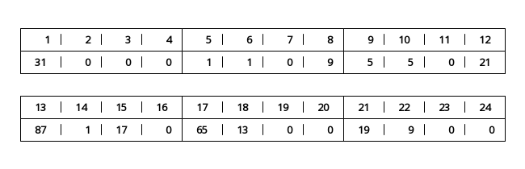
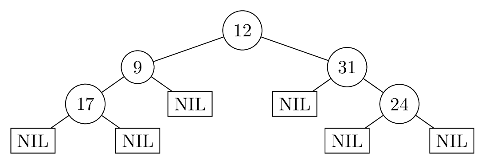

# Übungsblatt 9
## 1. Binärbäume
### a)
> Fügen Sie die Schlüssel $31, 1, 5, 87, 65, 19$ in dieser Reihenfolge in einen anfangs leeren binären Suchbaum ein.


### b)
> Übersetzen Sie Ihren Suchbaum aus Aufgabenteil a) in die Darstellung im Speicher eines Rechners. Nehmen Sie dazu folgendes an:
> 1. Die Knoten des Baums liegen, beginnent bei Speicheradresse $1$, in der gleichen Reihenfolge aus a) im Speicher.
> 2. Der Baum liegt in einer ununterbrochenen Sequenz im Speicher (Zwischen den Speicherzellen für die Knoten sind keine anderen Speicherzellen).

Der Verbund $\mathrm{Knoten}$ wie folgt definiert, zudem wird $\mathrm{NIL}$ als $0$ eingetragen.

```
Verbund Knoten
    key
    parent
    left
    right
```



### c)
> Übersetzen Sie die gegebene Sequenz [an Speicherzellen] in einen Binärbaum und zeichnen Sie diesen.



### d)
> Löschen Sie die Schlüssel $33$, $42$, $29$ in dieser Reihenfolge aus dem [Such-]Baum.


### e)
> Betrachten Sie den folgenden Algorithmus:
>
> ```
> Traversierung(x):
>     if x !+ NIL then
>         Traversierung(right[x])
>         Traversierung(left[x])
>         Ausgabe key[x]
> ```
>
> Wenden Sie, auf Ihrem Binärbaum aus Teilaufgabe c), den Algorithmus $\mathrm{Traversierung}$ an, und verwenden Sie den Wurzelknoten Ihres Binärbaums als initialen Eingabeparameter. Geben Sie die Ausgaben und deren Reihenfolge an.

1. $24$
2. $31$
3. $17$
4. $9$
5. $12$

## 2. Datenstruktur entwickeln
> Sei $k \in\mathbb N$ eine Konstante und $U = \{1,\dots, k\}$ ein Universum. Gesucht ist eine Datenstruktur zur Repräsentation von Multimengen aus dem Universum $U$. Eine Multimenge $M$ aus dem Universum $U$ kann jedes Element $x \in U$ gar nicht, einmal oder auch mehrmals enthalten. Die gesuchte Datenstruktur soll folgende Operationen in den jeweils angegebenen Laufzeiten unterstützen.
> 
> * $\mathrm{Add}(M, x)$ fügt der Multimenge $M$ das Element $x$ einmal hinzu. Laufzeit $\mathcal O(1)$.
> * $\mathrm{Remove}(M, x)$ entfernt das Element $x$ aus $M$, sodass $x$ anschließend gar nicht mehr in $M$ vorkommt. Laufzeit $\mathcal O(1)$.
> * $\mathrm{Count}(M, x)$ liefert, wie häufig $x$ in $M$ vorkommt. Laufzeit $\mathcal O(1)$.
> * $\mathrm{Merge}(M, N)$ liefert eine neue Multimenge $R$, sodass für jedes $x \in U$ die Anzahl von $x$ in $R$ der Summe der Anzahlen von $x$ in $M$ und in $N$ gleicht. Laufzeit $\mathcal O(k)$, also auch $\mathcal O(1)$, da $k$ eine Konstante ist.
> 
> Beschreiben Sie in wenigen kurzen Sätzen wie Ihre Datenstruktur aufgebaut ist. Schreiben Sie für jede der geforderten Operationen kommentierten Pseudocode und analysieren Sie dessen asymptotische Worst-Case-Laufzeit. Begründen Sie kurz, dass die Datenstruktur korrekt arbeitet.

Im Folgenden wird davon ausgegangen, dass $U$ die Größe $k$ hat und $M,N,R$ Multimengen von $U$ sind sowie $x\in U$. Dies ist nach Aufgabenstellung gegeben. Sollten diese Bedingungen nicht erfüllt sein, z.B. $x>k$, wird der folgende Pseudocode nicht funktionieren.

### $M$
$M$ kann als Feld implementiert werden. Sei $M=\mathrm{new\ array}[1..k]$, dann wird an der Stelle $M[x]$ die Anzahl der Elemente $x\in M$ gespeichert. Dadurch kann in konstanter Laufzeit die Anzahl eines Elementes verändert oder gezählt werden.

Mit der Funktion $\mathrm{initialize}(k)$ kann man in der Laufzeit $\mathcal O(k)$ eine leere Multimenge für ein Universum der Größe $k$ erstellen.

```
initialize(k)
    M = new array[1..k]
    for x=1 to k do
        M[x] = 0
    return M
```

Man könnte auch ein weiteres Element an der Stelle $M[0]$ speichern, in der man die Anzahl aller Elemente von $M$ speichert. Dann kann man z.B. in konstanter Laufzeit prüfen, ob $M=\{\}$ die leere Menge ist.

### $\mathrm{Add}(M, x)$
```
Add(M, x)
    M[x] = M[x] + 1
```

Die Laufzeit des Algorithmus ist $1\in\mathcal O(1)$, da nur eine Pseudocode-Operation ausgeführt wird. Hierbei wird die Anzahl des Elementes $x$ um $1$ erhöht, es wird also ein Element $x$ zur Menge $M$ hinzugefügt.

### $\mathrm{Remove}(M, x)$
```
Remove(M, x)
    M[x] = 0
```

Die Laufzeit des Algorithmus ist $1\in\mathcal O(1)$, da nur eine Pseudocode-Operation ausgeführt wird. Hierbei wird die Anzahl des Elementes $x$ auf $0$ gesetzt, es werden daher alle Elemente mit dem Wert $x$ aus der Menge $M$ gelöscht.

### $\mathrm{Count}(M, x)$
```
Count(M, x)
    return M[x]
```

Die Laufzeit des Algorithmus ist $1\in\mathcal O(1)$, da nur eine Pseudocode-Operation ausgeführt wird. Da $M[x]$ die Anzahl der Elemente mit dem Wert $x$ speichert, wird die korrekte Anzahl zurückgegeben.

### $\mathrm{Merge}(M, N, k)$
```
Merge(M, N, k)
    R = new array[1..k]
    for x=1 to k do
        R[x] = M[x] + N[x]
    return R
```

In Zeile $1$ wird eine neue Multimenge $R$ erstellt. Dies verhindert, dass eine der Multimengen $M,N$ verändert wird. Dann wird in Zeile $3$ die Gesamtzahl der Elemente $x$ in der Vereinigungsmenge $M\cup N$ ermittelt, was durch die Summe dargestellt wird. Dies erfolgt für alle Werte von $x$ (Zeile $2$), daher wird in Zeile $4$ die korrekt gebildete Multimenge $R$ zurückgegeben.

Die Laufzeit von $\mathrm{Merge}(M, N, k)$ ist $T(n)\in\mathcal O(k)$, also konstant in $n$:

* Zeile $1$ benötigt eine Laufzeit von $k$.
* Zeile $2$ wird $k+1$-mal ausgeführt und benötigt jeweils eine Laufzeit von $1$.
* Zeile $3$ wird $k$-mal ausgeführt und benötigt jeweils eine Laufzeit von $1$.
* Zeile $4$ benötigt eine Laufzeit von $1$.
