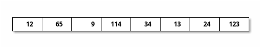

Die Abbruchbedingungen für Rekursion oder Schleifen werde ich oft mit "kleiner" oder "größer" angeben. Im Unterschied zu "gleich" ist dies oft resistenter gegen (Eingabe-)Fehler und kann Endlosschleifen bzw. -rekursionen verhindern.

# 1. Rekursion

> Geben Sie in Pseudocode einen rekursiven Algorithmus an, welcher für zwei gegebene Zahlen $n$ und $a$ das Produkt $\sum_{i=0}^n a^i$ berechnet.

Umgeschrieben lautet die Formel folgendermaßen:
$$
    f(n, a) = \prod_{i=0}^n a^i = a^0 \cdot a^1 \cdot a^2 \cdots  a^{n-1} \cdot a^n
$$
```
f(a, n):
    if n < 1 then return 1 \* a^0 = 1 \*
    return power(a, n) - f(a, n-1) \* a^n - f(a, n-1) \*

\* a^n \*
power(a, n):
    if n<2 then return a
    return a * power(a, n-1)
```

# 2. Felder

## 2.a
> Gegeben sei ein Feld $A$ mit $n$ Zahlen $a_1, a_2 ,\dots , a_n$. Gesucht ist das Paar zweier benachbarter Elemente im Array mit maximaler Differenz.
> 
> Geben Sie in Pseudocode einen rekursiven Algorithmus an, der das Paar $(i, i + 1)$ berechnet, das $|a_i − a_{i+1} |$ maximiert.

Diese Prozedur wird den Index des ersten Elementes $i$ zurückgeben. Das komplette Paar steht dann an den Positionen $i$ und $i+1$. Zudem muss die korrekte Länge $n$ des Feldes übergeben werden.

Da wir in unserem Pseudocode bislang keine Fehler melden können, gebe ich stattdessen $\mathrm{NIL}$ zurück.
```
A = new array[n]

max_abs_diff_pos(A, n):
    \* Fehler bei n<2: mindestens 2 Elemente erwartet. \*
1.  if n < 2 then return NIL
2.  if n = 2 then return 1

    \* Position des Paares mit maximaler Differenz bis [n-1] \*
3.  prev_max_diff_pos = max_abs_diff_pos(A, n-1)

    \* berechne Differenzen \*
4.  diff = abs_diff(A[n-1], [n])
5.  max_diff = abs_diff(A[prev_max_diff_pos], A[prev_max_diff_pos-1])

6.  if diff > max_diff then return diff
7.  else return max_diff

\* berechne den Betrag der Differenz aus a und b \*
abs_diff(a, b):
1. diff = a - b
2.  if diff > 0 then return diff
3.  else return -1 * diff
```

## 2.b
> Geben Sie die Laufzeit ihres Algorithmus aus Teilaufgabe a) an.

* Laufzeit $\mathrm{abs\_diff}$: $3$ Zeitschritte
    * Zeile 1: $1$
    * Zeile 2 + Zeile 3: $2$
* Laufzeit $\mathrm{max\_abs\_diff\_pos}$: $t_n$
    * Zeile 1: $n-1$
    * Zeile 2: $n$ (einmal wird der Wert zurückgegeben)
    * Zeile 3: $2 +t_{n-1}$
    * Zeile 4: $2 + 3=5$
    * Zeile 5: $5$
    * Zeile 6 + Zeile 7: $2$

Daraus folgt:
$$
\begin{align*}
    t_n &= 2n + 14 + t_{n-1} \\
        &= \sum_{i=2}^n 2i + 14 \\
        &= 14(n-1) + 2\cdot\sum_{i=1}^{n-1} i \\
        &= 14n - 14 + 2\cdot\frac{n(n+1)}{2} \\
    t_n &= n^2 + 15n - 14
\end{align*}
$$

Damit braucht der Algorithmus $\mathrm{max\_abs\_diff\_pos}$ $n^2 + 15n - 14$ Zeitschritte, läuft also in $\mathcal O (n^2)$. 

# 3
> In den folgenden Teilaufgaben sind eine Problemstellung und ein rekursiver Algorithmus zum Lösen des Problems gegeben. Jedoch haben sich Fehler in die Algorithmen eingeschlichen. Finden und korrigieren Sie die Fehler, sodass die betroffenen Algorithmen ihr Problem richtig lösen. Verändern Sie dabei so wenig wie möglich an dem vorhandenen Pseudocode!

## a
> Gegeben sei eine natürliche Zahl $n$. Der folgende Algorithmus soll rekursiv die Summe $\sum_{i=1}^n i$ berechnen.
> ```
> Summe(n)
> 1. if i = 0 then return 1
> 2. return n + Summe(n + 1)
> ```

* Zeile $1$: Problem: die Abbruchbedingung und der Rückgabewert stimmen nicht überein
* Zeile $2$: Der Aufruf der Summenfunktion muss den nächstkleineren Wert aufrufen, nicht den nächstgrößeren

Korrigierter Pseudocode:
```
Summe(n)
1. if i = 1 then return 1
2. return n + Summe(n - 1)
```

## b
> Gegeben seien zwei natürliche Zahlen $n$ und mit $n \ge k$. Der folgende Algorithmus soll rekursiv den Binomialkoeffzienten ${n \choose k} = {n-1 \choose k-1} + {n-1 \choose k}$ berechnen.
> ```
> Binom(n, k)
> 1. return Binom(n − 1, k − 1) + Binom(n − 1, k)
> ```

* Es fehlt die Abbruchbedingung vor Zeile $1$.
    * ${n \choose n} = {n \choose 0} = 1$
    * daher muss bei $k=0$ oder $n=k$ abgebrochen werden

Korrigierter Pseudocode:
```
Binom(n, k)
1. if k = 0 or k = n then return 1
2. return Binom(n − 1, k − 1) + Binom(n − 1, k)
```

# 4. Insertion Sort
> Gegeben sei das folgende Feld A:
> 
> Verwenden sie InsertionSort, um das Feld A zu sortieren. Geben Sie dabei den Zustand
des Feldes nach jeder Iteration der for-Schleife an.


* $i = 2$

* $i=3$

* $i=4$

* $i=5$

* $i=6$

* $i=7$

* $i=8$


