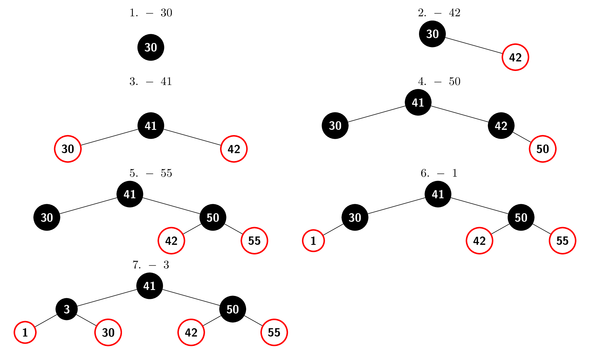
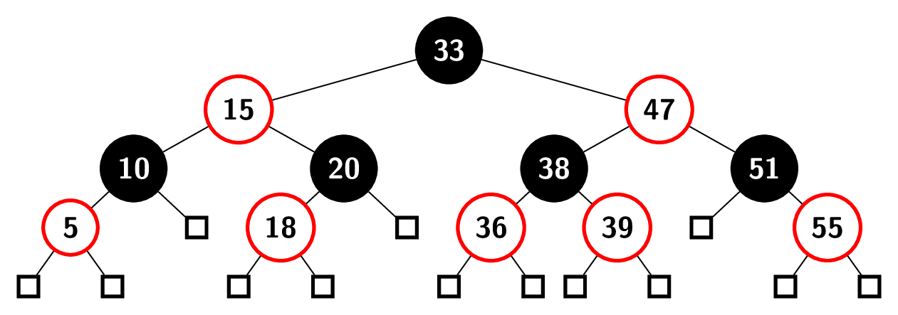

# Übungsblatt 10
## Rot-Schwarz-Bäume
### a)
> Vervollständigen Sie die Methode RS-Einfügen-Fix aus der Vorlesung [...], indem Sie den else-Fall ergänzen.

```
RSEinfügenFix(T,z)
    while color[parent[z]] = rot do
        if parent[z] = left[parent[parent[z]]] then
            y = right[parent[parent[z]]] \\ Onkel von z

            if color[y] = rot then \\ Onkel ist rot
                \\ schiebe rote "Ebene" eine Stufe höher
                color[parent[z]] = schwarz
                color[y] = schwarz
                color[parent[parent[z]]] = rot
                \\ prüfe beim Großvater weiter
                z = parent[parent[z]]
            else \\ Onkel schwarz
                if z = right[parent[z]] then
                    \\ parent[z] rechter Knoten
                    Linksrotation(T, parent[z])
                    \\ prüfe beim Vater weiter
                    z = parent[z]
                else \\ z und parent[z] linke Knoten
                    color[parent[z]] = schwarz
                    color[parent[parent[z]]] = rot
                    Rechtsrotation(T, parent[parent[z]])
        else
            \\ ab hier kommt der selbstgeschriebene Teil
            y = left[parent[parent[z]]] \\ Onkel von z

            if color[y] = rot then \\ Onkel ist rot
                \\ schiebe rote "Ebene" eine Stufe höher
                color[parent[z]] = schwarz
                color[y] = schwarz
                color[parent[parent[z]]] = rot
                \\ prüfe beim Großvater weiter
                z = parent[parent[z]]
            else \\ Onkel schwarz
                if z = left[parent[z]] then
                    \\ und parent[z] linker Knoten
                    Rechtsrotation(T, parent[z])
                    \\ prüfe beim Vater weiter
                    z = parent[z]
                else \\ z und parent[z] rechte Knoten
                    color[parent[z]] = schwarz
                    color[parent[parent[z]]] = rot
                    Linksrotation(T, parent[parent[z]])
            \\ bis hier geht der selbstgeschriebene Teil
    color[root[T]] = schwarz
```

### b)
> Fügen Sie die Schlüssel $30, 42, 41, 50, 55, 1, 3$ in dieser Reihenfolge in einen anfangs leeren Rot-Schwarz-Baum ein und notieren Sie dabei nach jeder Operation den resultierenden Baum.



### c)
> Löschen Sie die Werte $5, 10, 47, 20$ und $18$ in der genannten Reihenfolge [aus dem folgenden Rot-Schwarz-Baum]. Zeichnen Sie den Rot-Schwarz-Baum nach jedem Löschen und geben Sie an, welche Fälle durchgeführt wurden.




## Suchbäume
> Sei $T$ ein binärer Baum, der nicht zwingend die Suchbaumeigenschaft erfüllt. Es soll nun geprüft werden, ob $T$ ein Suchbaum ist. Für den binären Baum $T$ liefert $\mathrm{root}(T)$ den Wurzelknoten von $T$ . Für jeden Knoten $v \in V$ im binären Baum T stehen folgende Operationen mit Laufzeit $\mathcal O(1)$ zur Verfügung.
> 
> * $\mathrm{key}(v)$ liefert den im Knoten $v$ enthaltenen Schlüssel.
> * $\mathrm{lc}(v)$ liefert einen Zeiger auf das linke Kind von $v$ in $T$. Hat $v$ kein linkes Kind, liefert $\mathrm{lc}(v)$ den Wert $\mathrm{NIL}$.
> * $\mathrm{rc}(v)$ liefert einen Zeiger auf das rechte Kind von $v$ in $T$. Hat $v$ kein rechtes Kind, liefert $\mathrm{rc}(v)$ den Wert $\mathrm{NIL}$.
> * $\mathrm{leaf}(v)$ liefert $\mathrm{true}$, falls der Knoten $v$ in $T$ ein Blatt ist. Sonst liefert $\mathrm{leaf}(v)$ den Wert $\mathrm{false}$.
> 
> Für diese Aufgabe soll $T$ ein vollständiger binärer Baum sein. Das heißt, dass jeder innere Knoten in $T$ genau zwei Kinder hat und alle Blätter von $T$ auf der selben Höhe sind.

### a)
> Entwerfen Sie einen Teile-und-Herrsche-Algorithmus, der bei Eingabe eines binären Baumes $T$ mit Knotenmenge $V$ den Wert $\mathrm{true}$ zurückgibt, falls $T$ die Suchbaumeigenschaft erfüllt. Erfüllt $T$ die Suchbaumeigenschaft nicht, soll der Algorithmus $\mathrm{false}$ zurückgeben. Beschreiben Sie Ihren Algorithmus in eigenen Worten und geben Sie den Algorithmus auch in Pseudocode an. Für die volle Punktzahl wird ein Algorithmus erwartet, dessen Laufzeit durch $\mathcal O(|V|)$ beschränkt ist.

Der Algorithmus beginnt an der Wurzel $\mathrm{root}[T]$ und iteriert über alle Knoten. Falls eine Stelle falsch sortiert ist, so kann die Rekursion an dieser Stelle abgebrochen werden. Falls ein Blatt erreicht wurde, ist dieses ein gültiger binärer Suchbaum und eine Rekursionskette hat ihr Ende erfolgreich erreicht.

Ansonsten muss für jeden Knoten $v$ überprüft werden, dass $\mathrm{key}(\mathrm{lc}(v))  \le \mathrm{key}(v) \le \mathrm{key}(\mathrm{rc}(v))$. Wenn dies nicht stimmt, kann $T$ kein binärer Suchbaum sein. Ansonsten ist der Baum genau dann ein binärer Suchbaum, wenn beide Kinder die Wurzel eines binären Suchbaums bilden.

```
isSearchTree(v) \\ erster Aufruf: isSearchTree(root[T])
    if leaf(v) then return true \\ Ende erreicht

    left = lc(v)
    right = rc(v)

    \\ sind Kinder sind falsch sortiert?
    \\ falls ja: Abbruch
    if key(left) > key(v) then return false
    if key(right) < key(v) then return false

    if isSearchTree(left)
    then return isSearchTree(right)
    else return false
```

### b)
> Analysieren Sie die Laufzeit Ihres Algorithmus.

```
isSearchTree(v) \\ T(n)
    if leaf(v) then return true \\ O(1)

    left = lc(v) \\ O(1)
    right = rc(v) \\ O(1)

    if key(left) > key(v) then return false \\ O(1)
    if key(right) < key(v) then return false \\ O(1)

    if isSearchTree(left) \\ T(n/2)
    then return isSearchTree(right) \\ T(n/2)
    else return false \\ O(1)
```

Sei $f(n)\in\mathcal O(1)$, dann beschreibt die folgende rekursive Funktion die Laufzeit $T(n)$.

$$
    T(n) =
        \begin{cases}
            f(n) &: n=1 \\
            2T\left(\frac{n}{2}\right) + f(n) &: n>1
        \end{cases}
$$

Es gilt $\forall n>1: T(n) = aT\frac{n}{b} + f(n)$ mit $a=b=2$. Sei $f(n)=c$ mit konstantem $c$, so gilt $f(n) = a\cdot f(\frac{n}{2})=c$. Nach Teil $1$ des Mastertheorems fließt in jeder Rekursionsebene der Aufwand $f(n)$ ein und die Laufzeit ist $T(n)\in\mathcal O(f(n)\cdot\log_2n)$. Da $f(n)\in\mathcal O(1)$ eine konstante Laufzeit beschreibt, ist es ein konstanter Faktor $c$. Es gilt weiterhin $\mathcal O(c\log_2n)\subseteq \mathcal O(\log_2n)$.

$$
    T(n) = \mathcal O(\log_2n)
$$
Die Funktion benötigt daher logarithmische Laufzeit.

### c)
> Beweisen Sie die Korrektheit Ihres Algorithmus.

```
isSearchTree(v) \\ T(n)
1.    if leaf(v) then return true \\ O(1)

2.    left = lc(v) \\ O(1)
3.    right = rc(v) \\ O(1)

4.    if key(left) > key(v) then return false \\ O(1)
5.    if key(right) < key(v) then return false \\ O(1)

6.    if isSearchTree(left) \\ T(n/2)
7.    then return isSearchTree(right) \\ T(n/2)
8.    else return false \\ O(1)
```

#### Induktionsvoraussetzung
Sei $T$ ein Baum der Höhe $0$ mit genau einem Knoten, dann ist $v=\mathrm{root}[T]$ ein Blatt. In diesem Fall wird in Zeile $1$ $\mathrm{true}$ zurückgegeben. Dies ist korrekt, da ein Baum mit einem Blatt immer sortiert und damit ein binärer Suchbaum ist.

#### Induktionsannahme
Seien $T$ ein vollständiger binärer Baum der Höhe $h$ und $T^\prime$ ein vollständiger binärer Baum der Höhe $h-1$. Seien weiterhin $v=\mathrm{root}[T]$, $u=\mathrm{root}[T^\prime]$ und $u=\mathrm{root}[T^\prime]$. Sei $u$ ein Kind von $v$.

Gebe $\mathrm{isSearchTree}(u)$ an, ob $T^\prime$ ein binärer Suchbaum ist. Dann ist zu zeigen, dass $\mathrm{isSearchTree}(v)$ korrekt bestimmt, ob $T$ ein binärer Suchbaum ist.

#### Induktionsschritt
Da $v$ kein Blatt ist, passiert in Zeile $1$ nichts. In den Zeilen $2$ werden die Kinder von $v$ ermittelt.

Falls die Gleichung $\mathrm{key}(\mathrm{lc}(v))  \le \mathrm{key}(v) \le \mathrm{key}(\mathrm{rc}(v))$ _nicht_ erfüllt ist, so ist $T$ kein binärer Suchbaum. In diesem Fall wird entweder in Zeile $4$ oder in Zeile $5$ $\mathrm{false}$ zurückgegeben, was den korrekten Zustand abbildet.

Ansonsten wird in Zeile $6$ geprüft, ob das linke Kind von $v$ ein korrekter Suchbaum ist. Mit $u=\mathrm{lc}(v)$ gibt die Prozedur $\mathrm{isSearchTree}(u)$ nach Induktionsannahme den korrekten Zustand zurück. Falls unter $\mathrm{lc(v)}$ kein binärer Suchbaum ist, ist auch $T$ kein binärer Suchbaum und es wird in Zeile $8$ $\mathrm{false}$ zurückgegeben.

Ansonsten ist $T$ genau dann ein binärer Suchbaum, wenn auch $u=\mathrm{rc}(v)$ die Wurzel eines binären Suchbaums ist. Dieser Wert wird genau dann in Zeile $7$ zurückgegeben, wenn $\mathrm{isSearchTree}(u)$ den richtigen Zustand zurückgibt. Dies ist nach Induktionsannahme der Fall.

Damit ist $\mathrm{isSearchTree}(v)$ korrekt.
