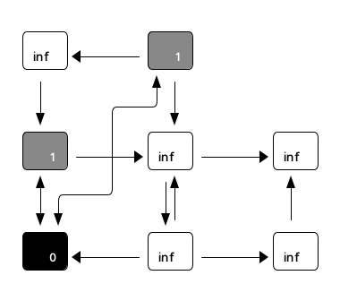

# Übungsblatt 11
## 1. Hashtabelle
> Gegeben seien eine Hashtabelle der Größe $m = 11$ und die Hashfunktion $h(x) = x \mod m$.
> 
> Fügen Sie die Schlüssel $112, 121, 17, 356, 202, 876, 394, 26, 742, 652$ in der angegebenen Reihenfolge nach dem Schema offener Addressierung mit linearem Ausprobieren in die Hashtabelle ein. (Es genügt, das Endergebnis aller Einfügeoperationen anzugeben.)

| 0   | 1 | 2   | 3   | 4   | 5   | 6  | 7   | 8  | 9   | 10  |
|:---:|:-:|:---:|:---:|:---:|:---:|:--:|:---:|:--:|:---:|:---:|
| 121 |   | 112 | 652 | 356 | 202 | 17 | 876 | 26 | 394 | 742 |

## 2. Breitensuche
> Führen Sie auf dem gegebenen Graphen den Breitensuche-Algorithmus aus. Gehen Sie dabei so vor, dass der Knoten $a$ als Startknoten genutzt wird und bei mehreren benachbarten Knoten der mit dem lexikographisch kleineren Buchstaben zuerst der Warteschlange hinzugefügt wird.
> 
> Skizzieren Sie für jeden Schritt der Traversierung den Zustand der Breitensuche. Geben Sie dazu jeweils die Färbung der Knoten und den Inhalt der Warteschlangen-Datenstruktur an.


#### 1. $a$


#### 2. $b$


#### 3. $d$


#### 4. $f$


#### 5. $h$


#### 6. $c$


#### 7. $e$


#### 8. $g$


## 3. Kreisfreiheit
> Ein ungerichteter Graph heißt _kreisfrei_, wenn es für jedes Knotenpaar $u, v \in V \times V$ nur einen Pfad von $v$ nach $u$ gibt.

### a)
> Gegeben sei ein ungerichteter zusammenhängender Graph $G = (V, E)$ in Adjazenzlistendarstellung. Geben Sie einen Algorithmus in Pseudocode an, der in Zeit $\mathcal O(|V | + |E|)$ entscheidet ob der Graph $G$ kreisfrei ist. Erklären oder kommentieren Sie Ihren Pseudocode.

Der Algorithmus führt eine Breitensuche aus. Falls dabei ein gefundener Knoten erneut gefunden wird, wurde ein Kreis gefunden. Die einzige Ausnahme ist der Vater im Breitensuchbaum, der der einzige bekannte Nachbar sein muss.

```
IstKreisfrei(G,s)
1.   initialisiere BFS
2.   while Q != {} do
3.       u = head[Q]
4.       for each v in Adj[u] do
5.           \\ breche ab, falls Knoten bekannt
6.           \\ es sei denn, v ist der Vater im BFS
7.           if color[v] != weiß and pi[u] != v
8.               then return false

9.           if color[v] = weiß
10.          then
11.             \\ Knoten ist neu
12.              color[v] = grau
13.              d[v] = d[u] + 1
14.              pi[v] = u
15.              enqueue(Q,v)
16.      dequeue(Q)
17.      color[u] = schwarz
18.  return true
```

### b)
> Analysieren Sie die asymptotische Worst-Case-Laufzeit Ihres Algorithmus.

Der Algorithmus wurde nicht strukturell verändert, daher ist die Worst-Case-Laufzeit wie die der Breitensuche $\mathcal O(|V|+|E|)$. Die Laufzeit kann nur um einen konstanten Term verändert. Dagegen kann die Laufzeit deutlich schneller sein, falls ein Kreis gefunden wird.

### c)
> Beweisen Sie die Korrektheit Ihres Algorithmus.

Für den Startknoten $s$ werden alle Nachbarn erreichbaren Knoten entdeckt und markiert. Wird nach Zeile $4$ ein bereits entdeckter Knoten $v$ als Nachbarknoten von $u$ erkannt, so gibt es zu diesem Nachbarknoten zwei Wege: Der Weg, auf dem $v$ ursprünglich entdeckt wurde, und der Weg über $u$. Weil beide Wege an $s$ starten, gibt es mehrere verschiedene Wege zu $v$. Dies entspricht der Definition eines Kreises, deswegen muss in Zeile $8$ $\mathrm{false}$ zurückgegeben werden, dabei wird die Breitensuche abgebrochen. Falls die Breitensuche vollständig beendet ist, ist der Graph kreisfrei, weshalb in Zeile $18$ $\mathrm{true}$ zurückgegeben wird.
