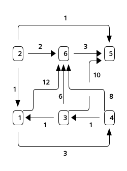

# Übungsblatt 12
## 1. Bellman-Ford
> Führen Sie die verbesserte Version des Algorithmus von Bellman-Ford für den gegebenen Graphen mit Startknoten $1$ aus. Tragen Sie dazu die Werte des Arrays $d$ nach jedem Durchlauf der äußeren Schleife des Algorithmus in die Tabelle unten ein. Gehen Sie dabei die Knoten in aufsteigender Reihenfolge durch.
> 

| i | d[1] | d[2] | d[3] | d[4] | d[5] | d[6] |
|:-:|:----:|:----:|:----:|:----:|:----:|:----:|
| 0 | 0    | inf  | inf  | inf  | inf  | inf  |
| 1 |      |      |      |      |      |      |
| 2 |      |      |      |      |      |      |
| 3 |      |      |      |      |      |      |
| 4 |      |      |      |      |      |      |
| 5 |      |      |      |      |      |      |
| 6 |      |      |      |      |      |      |

## 2. Graphalgorithmen
> Sei $G = (V, E)$ ein ungerichteter Graph. Eine unabhängige Menge ist eine Teilmenge $U \subseteq V$ der Knotenmenge, für die gilt, dass kein Knotenpaar $u, v \in U$ durch eine Kante verbunden ist. Wir betrachten nun den Spezialfall, dass $G$ ein ungerichteter Graph mit maximalem Knotengrad $d$ ist, d.h. jeder Knoten $v \in V$ hat maximal $d$ Nachbarn.

### a)
> Beschreiben Sie einen gierigen Algorithmus für diesen Spezialfall (nicht notwendigerweise Pseudocode), der für einen gradbeschränkten Graphen $G$ mit maximalem Knotengrad $d$ eine unabhängige Menge berechnet, die mindestens die Größe $\lceil \frac{n}{d+1}\rceil$ hat. Für die volle Punktzahl wird ein Algorithmus erwartet, dessen Worst-Case-Laufzeit durch $\mathcal O(d |V|)$ beschränkt ist.

### b)
> Begründen Sie, warum Ihr Algorithmus die vorgegebene Laufzeitschranke einhält oder geben Sie, falls ihr Algorithmus diese Schranke nicht einhält, eine möglichst gute Schranke für die Worst-Case-Laufzeit Ihres Algorithmus an und begründen Sie diese.

### c)
> Beweisen Sie die Korrektheit Ihres Algorithmus, d.h. dass ihr Algorithmus für jeden ungerichteten Graphen $G$ mit maximalem Knotengrad $d$ eine unabhängige Menge berechnet, die mindestens $\lceil \frac{n}{d+1}\rceil$ Knoten enthält.

## 3. Graphalgorithmen
> Marie fand einen Zettel, auf dem ein ungerichteter zusammenhängender Graph $G = (V, E)$ gezeichnet ist. Marie hat vier Farbstifte: rot, blau, schwarz und grün. Sie hat zuerst alle Kanten entweder in rot ($X$) oder blau ($Y$) gefärbt, wobei $E = X \cup Y$ ist.
> 
> Jetzt möchte Marie die Knoten in schwarz oder grün färben, und zwar so, dass die Knoten der roten Kanten beide schwarz oder beide grün sind, und dass die Knoten der blauen Kanten unterschiedlich gefärbt werden.

### a)
> Entwerfen Sie einen Algorithmus $\mathrm{Farben}(V, X, Y)$, der entscheidet, ob solche Knotenfärbung möglich ist und dementsprechend $\mathrm{true}$ bzw. $\mathrm{false}$ zurückgibt. Beschreiben Sie den Algorithmus zunächst mit eigenen Worten. Setzen Sie den Algorithmus dann in Pseudocode um. Für die volle Punktzahl wird ein Algorithmus erwartet, dessen Laufzeit durch $\mathcal O(|V | + |E|)$ beschränkt ist.

### b)
> Analysieren Sie die Laufzeit Ihres Algorithmus.

### c)
> Beweisen Sie die Korrektheit Ihres Algorithmus.
