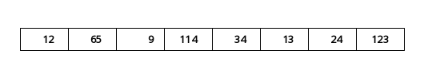
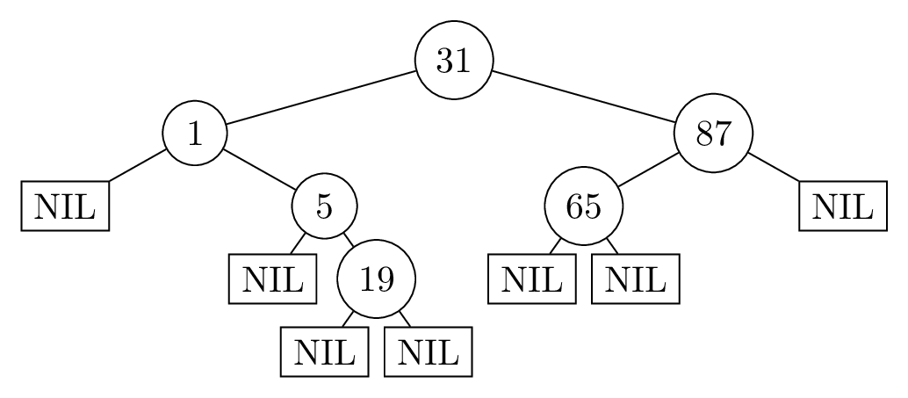
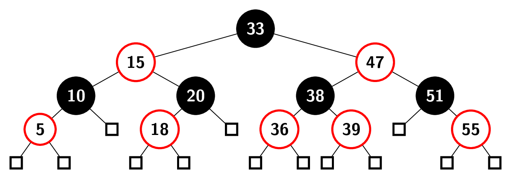
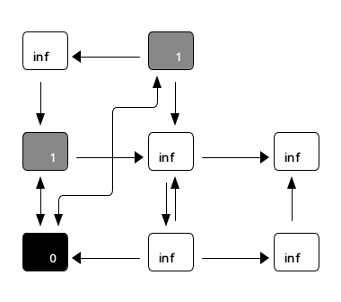

# Übungsblatt 0
## 3. Pseudocode
> **a)** Gegeben ein Feld A der Länge $n$. Schreiben Sie einen Algorithmus in Pseudocode, der die Summe aller Elemente aus $A$ ausgibt.
> 
> **b)** Gegeben ein Feld $A$ der Länge $n$. Verwenden Sie Ihren Algorithmus aus der vorherigen Teilaufgabe, um den Durchschnitt der Elemente aus $A$ zu berechnen.
> 
> **c)** Gegeben ein Feld $A$ der Länge $n$ mit den Werten $a_1, a_2,\dots, a_n$ und eine Zahl $m \in \mathbb N$. Sei $k$ die größte Zahl, so dass gilt $\sum^k_{i=1} a_i \le m$. Entwickeln Sie einen Algorithmus, der $k$ berechnet.

# Übungsblatt 1
## 1. Rekursion
> Geben Sie in Pseudocode einen rekursiven Algorithmus an, welcher für zwei gegebene Zahlen $n$ und $a$ das Produkt $\sum_{i=0}^n a^i$ berechnet.

## 2. Felder
> **a)** Gegeben sei ein Feld $A$ mit $n$ Zahlen $a_1, a_2 ,\dots , a_n$. Gesucht ist das Paar zweier benachbarter Elemente im Array mit maximaler Differenz.
> 
> Geben Sie in Pseudocode einen rekursiven Algorithmus an, der das Paar $(i, i + 1)$ berechnet, das $|a_i - a_{i+1}|$ maximiert.
> 
> **b)** Geben Sie die Laufzeit ihres Algorithmus aus Teilaufgabe a) an.

## 3.
> In den folgenden Teilaufgaben sind eine Problemstellung und ein rekursiver Algorithmus zum Lösen des Problems gegeben. Jedoch haben sich Fehler in die Algorithmen eingeschlichen. Finden und korrigieren Sie die Fehler, sodass die betroffenen Algorithmen ihr Problem richtig lösen. Verändern Sie dabei so wenig wie möglich an dem vorhandenen Pseudocode!
> 
> **a)** Gegeben sei eine natürliche Zahl $n$. Der folgende Algorithmus soll rekursiv die Summe $\sum_{i=1}^n i$ berechnen.
> ```
> Summe(n)
> 1. if i = 0 then return 1
> 2. return n + Summe(n + 1)
> ```
> 
> **b)** Gegeben seien zwei natürliche Zahlen $n$ und mit $n \ge k$. Der folgende Algorithmus soll rekursiv den Binomialkoeffzienten ${n \choose k} = {n-1 \choose k-1} + {n-1 \choose k}$ berechnen.
> ```
> Binom(n, k)
> 1. return Binom(n - 1, k - 1) + Binom(n - 1, k)
> ```

## 4. Insertion Sort
> Gegeben sei das folgende Feld A:
> Verwenden sie $\mathrm{InsertionSort}$, um das Feld $A$ zu sortieren. Geben Sie dabei den Zustand
des Feldes nach jeder Iteration der for-Schleife an.



# Übungsblatt 2
## 1. Laufzeitanalyse
> Betrachten Sie folgenden Algorithmus:
> ```
> BerechneZahl(int n):
>     a = 1
>     b = 1
>     c = 1
>     d = 1
>     for i = 1 to n do
>         a = a*i
>     for i = 1 to n do
>         for j = 1 to i do
>             b = b*j
>
>         for j = 1 to n - i do
>             c = c * (j + i)
>         d = d - a/(b * c)
>         b = 1
>         c = 1
>     return d
> ```
> 
> **a)** Analysieren Sie die asymptotische Worst-Case-Laufzeit des Algorithmus. Das heißt:
> 1. Notieren Sie die Anzahl der Rechenschritte zeilenweise in Abhängigkeit der Eingabegröße $n$.
> 2. Summieren Sie die Gesamtanzahl der Rechenschritte.
> 3. Ordnen Sie die asymptotische Laufzeit in $\mathcal O$-Notation ein.
> 
> **b)** Geben Sie an, was der Algorithmus bei Eingabe der natürlichen Zahl n berechnet. Erklären Sie die Funktionsweise des Algorithmus.
> 
> **c)** Lässt sich das Ergebnis des Algorithmus auch effizienter berechnen? Erklären Sie warum nicht oder geben Sie einen schnelleren Algorithmus an und analysieren Sie dessen asymptotische Worst-Case-Laufzeit.

## 2. Landau Notation
> Welche der folgenden Aussagen sind korrekt?
> 
> 1. $6n^2 + n^3 \in \mathcal O(n^2)$
> 2. $2\log_2 n \in \mathcal \Omega(n)$
> 3. $\mathcal O(n^2+2n) = \mathcal O(n^2)$
> 4. $3n^4 + 2n - 3 \in \Omega(n^3)$
> 5. $\log_2 n + 12 + n \in \mathcal O(n\log_2n)$

# Übungsblatt 3
## 1. Schleifeninvariante
> Betrachten Sie den folgenden Algorithmus, der als Eingabe ein Array $A = [a_1, a_2,\dots, a_n]$ der Länge $n$ mit $a_i \in\mathbb N$, $1 \le i \le n$ erhält.
> ```
> BerechneWert(A,n):
> 1.  p=0
> 2.  for i = 1 to n do
> 3.      p = p + A[i]
> 4. return p/n
> ```
> 
> **a)** Stellen Sie eine Behauptung auf, welchen Wert der Algorithmus in Abhängigkeit des Eingabearrays berechnet.
> 
> **b)** Formulieren Sie eine Schleifeninvariante, die zu Beginn jeder Iteration der for-Schleife (Zeilen 2 und 3) für die Variable $p$ gilt. Beweisen Sie diese mittels vollständiger Induktion.
> 
> **c)** Verwenden Sie die Schleifeninvariante aus Aufgabenteil b), um zu zeigen, dass die Behauptung aus Aufgabenteil a) korrekt ist.

## 2. Korrektheit
> Gegeben sei der folgende Algorithmus zur Berechnung der Potenz $a^b$ für zwei Zahlen $a,b\in \mathrm N_{\ge 0}$.
> ```
> Potenz(a, b):
>     if b = 0 then
>         return 1
>     return a · Potenz(a, b - 1)
> ```
> Beweisen Sie mithilfe von vollständiger Induktion die Korrektheit des Algorithmus. Zeigen Sie dazu einen Induktionsanfang für eine geignete Induktionsvariable, formulieren Sie eine Induktionsannahme und zeigen Sie unter dieser einen Induktionsschritt.

## 4. Teile & Herrsche
> Gegeben sei ein Feld $A$ mit $n$ natürlichen Zahlen. Entwickeln Sie einen rekursiven Teile-und-Herrsche-Algorithmus, der für die Eingabe $A$ die Anzahl der gerade Zahlen in $A$ berechnet. Geben Sie ihren Algorithmus in Pseudocode an und kommentieren Sie diesen.

# Übungsblatt 4
## 1. Binäre Suche
> Betrachten Sie das folgende Feld von Zahlen:
> 
> $A = [6, 3, 36, 99, 2, 39, 12, 45, 23, 17, 24]$
> 
> Strukturieren Sie die Elemente in dem Feld um, sodass Binäre Suche anwendbar ist.
> 
> Führen Sie anschließend die aus der Vorlesung bekannte Methode $\mathrm{BinäreSuche}(A,12,1,11)$ aus, um in dem Feld $A[1, \dots , 11]$ nach dem Wert $12$ zu suchen und geben Sie die Ausgabe, sowie die besuchten Teilfelder des Algorithmus an.

## 2. Teile und Herrsche
> Gegeben sei ein aufsteigend sortiertes Feld A aus n natürlichen Zahlen. Bei der Übertragung des Feldes ist ein Fehler unterlaufen. Die Diagnose des Fehlers besagt, dass es nach der Übertragung maximal einen Wert gibt, welcher verfälscht wurde. Dies bedeutet, dass die betroffene Stelle des Feldes einen größeren Wert als ursprünglich haben kann. Dadurch kann es sein, dass das Feld nach der Übertragung nicht mehr aufsteigend sortiert ist. Also kann binäre Suche auf dem Feld nicht mehr angewandt werden.
> 
> Trotz dieses Fehlers sollen aber alle unverfälschten Werte von Feld $A$ in Laufzeit $\mathcal O(\log n)$ gesucht werden können.
> 
> **a)** Entwickeln Sie einen Teile-und-Herrsche-Algorithmus, welcher das Feld $A$, dessen Länge $n$ und eine natürliche Zahl $x$ bekommt, und in Laufzeit $\mathcal O(\log n)$ die Position von $x$ im Feld $A$ zurückgibt, sofern $x$ ein unverfälschter Wert ist. Sollte $x$ durch den Übertragungsfehler in $A$ entstanden sein, kann der Algorithmus in Laufzeit $\mathcal O(\log n)$ $\mathcal O(\log n)$ die Position von $x$ ausgeben, oder einen Fehler ausgeben.
> 
> **b)** Beginnen Sie die Laufzeitanalyse Ihres Algorithmus, indem Sie eine Rekursionsgleichung für die Laufzeit herleiten und angeben.
> 
> **c)** Beweisen Sie die Korrektheit Ihres Algorithmus.

## 3. Rekursionsgleichungen
> Geben Sie für die folgenden Rekursionsgleichungen eine möglichst einfache und langsam wachsene Funktion $g(n)$ an, sodass $T(n)\in\mathcal O(g(n))$ ist.
> Gehen Sie dabei wie folgt vor:
> Lösen Sie die Rekursionsgleichungen auf, um eine nicht rekursive Funktion zu erhalten, welche die Laufzeit in Abhängikeit von $n$ beschreibt und beweisen Sie deren Korrektheit mittels Induktion. Drücken Sie nun Ihre bewiesene Funktion durch $\mathcal O$-Notation aus.
> 
> $T(n) = \begin{cases}1 & n=1 \\1\cdot T(\frac{n}{4}) + 4& \text{sonst}\end{cases}$
> 
> $T(n) = \begin{cases}1 & n=1 \\2\cdot T(\frac{n}{2}) + n^2& \text{sonst}\end{cases}$
> 
> $T(n) = \begin{cases}1 & n=1 \\3\cdot T(\frac{n}{2}) + n& \text{sonst}\end{cases}$

# Übungsblatt 5
## 1. Mastertheorem
> Verwenden Sie das Master-Theorem, um für die folgenden Rekursionsgleichungen asymptotische Schranken anzugeben.
> 
> $T(n) = \begin{cases}12 & n=1 \\2\cdot T(\frac{n}{2}) + 12& \text{sonst}\end{cases}$
> 
> $T(n) = \begin{cases}1 & n=1 \\1\cdot T(\frac{n}{3}) + n^3& \text{sonst}\end{cases}$
> 
> $T(n) = \begin{cases}1 & n=1 \\1\cdot T(\frac{n}{2}) + n& \text{sonst}\end{cases}$
> 
> $T(n) = \begin{cases}1 & n=1 \\2\cdot T(\frac{n}{4}) + \sqrt{n}& \text{sonst}\end{cases}$

## 2. Teile und Herrsche
> Wir betrachten den Aktienkurs der Firma Informatik AG. Der Wert einer Aktie über $n$ Zeiteinheiten wird dabei in dem Array $A$ gespeichert. Wir möchten wissen zu welchen Zeiten wir die Aktie kaufen und verkaufen sollten, um den maximalen Gewinn zu erziehlen.
> Kauf und Verkauf dürfen dabei aber nur einmal passieren.
> Formal ist also ein Array $A[1..n]$ von positiven ganzen Zahlen gegeben und wir wollen die größte Wertdifferenz $A[i] − A[j]$ für $j \le i$ bestimmen.
> 
> **a)** Betrachten Sie zwei benachbarte Teilarrays $A[i..j]$ und $A[j + 1..l]$ mit $1 \le i \le j < l \le n$. Welche Informationen über die Teilarrays werden benötigt, um die maximale Differenz zweier Elemente in $A[i..l]$ in konstanter Zeit zu berechnen? Erklären Sie auch wie diese Berechnung funktioniert.
> 
> **b)** Entwickeln Sie einen Teile-und-Herrsche-Algorithmus, der Ihre Überlegungen aus Aufgabenteil a) verwendet, um die größte Wertdifferenz zu berechnen. Geben Sie eine Implementierung Ihres Algorithmus in Pseudocode an und kommentieren Sie diesen. Für die volle Punktzahl wird ein Algorithmus erwartet, dessen Worst-Case-Laufzeit durch $\mathcal O(n)$ beschränkt ist.
> 
> **c)** Analysieren Sie die Laufzeit Ihres Algorithmus. Stellen Sie hierzu eine Rekursionsgleichung für die Laufzeit Ihres Algorithmus auf und lösen Sie diese. Sie dürfen das Mastertheorem verwenden.
> 
> **d)** Zeigen Sie die Korrektheit Ihres Algorithmus.

# Übungsblatt 6
## 1.
> Wir betrachten den Algorithmus $\mathrm{SubsetSum}(A, U, n)$ der Vorlesung. Gegeben sei die folgende Menge:
> 
> $A = \{19, 5, 7, 4, 12, 9, 2, 6, 4\}$ und der Wert $u = 15$.
> 
> Wenden Sie den Algorithmus der Vorlesung an, um zu entscheiden, ob es eine Teilmenge $L \subseteq A$ gibt, sodass $\sum_{x\in L} x = u$ gilt. Geben Sie dabei das vollständige Array $I$, sowie das Ergebnis des Algorithmus an.

## 2.
> Gegeben sei ein Array $A[1..n]$ mit $1 \le A[i] \le 3$ für alle $1 \le i \le n$. Eine Spielfigur startet auf der ersten Stelle des Arrays und muss die $n$-te Stelle erreichen. Befindet sich die Figur auf der Stelle $i$ für $1 \le i \le n$, so darf sie mit einem Sprung bis zu $A[i]$ Stellen nach vorne ziehen. Im unten gezeigten Beispiel darf die Figur also von der zweiten Stelle aus bis zu $A[2] = 3$ Stellen weiterspringen, also jede der Stellen $3$, $4$ und $5$ mit einem Sprung erreichen. Gesucht ist die minimale Anzahl von Sprüngen, um beginnend auf der ersten Stelle des Arrays die $n$-te Stelle zu erreichen.
> 
> Für das folgende Beispiel mit $n = 8$ beträgt die minimale Anzahl an Sprüngen $3$ und ergibt sich durch die Sprungfolge $1 \curvearrowright 2 \curvearrowright 5 \curvearrowright 8$.
> 
> $A= (2\ \ 3\ \ 1\ \ 2\ \ 3\ \ 1\ \ 2\ \ 1)$
> 
> Sei $M [i]$ die minimal benötigte Anzahl von Sprüngen, um ausgehend von der $i$-ten Stelle die $n$-te Stelle zu erreichen. Geben Sie eine rekursive Formulierung für $M [i]$ an. Erklären Sie die Funktionsweise dieser. Gehen Sie dabei auf jede Fallunterschiedung ein.

## 3.
> Gegeben sei eine Menge $A$ mit $n$ Zahlen. Die Anzahl der Partitionen von $A$ kann mit der sogenannten Stirling Zahl zweiter Art berechnet werden.
> 
> Diese Zahl $S(n, k)$ ist rekursiv definiert als:
> 
> $S(n,k) = \begin{cases}0 & \text{, falls } k=0,n>0 \\1 & \text{, falls } k=n \\S(n-1,k-1)+k\cdot S(n-1,k) & \text{\ \ sonst}\end{cases}$
> 
> und beschreibt wie viele Partitionen einer $n$-elementigen Menge es in $k$ disjunkte Teilmengen gibt.
> 
> **a)** Geben Sie einen rekursiven Algorithmus in Pseudocode an, welcher bei Eingabe einer Zahl $n$ unter Verwendung von $S(n, k)$ die Anzahl aller Partitionen einer Menge mit $n$ Elementen berechnet.
> 
> **b)** Analysieren Sie die asymptotische Worst-Case-Laufzeit Ihres Algorithmus aus Teilaufgabe a).
> 
> **c)** Geben Sie einen Algorithmus in Pseudocode an, der auf dem Prinzip der dynamischen Programmierung beruht, und bei Eingabe einer Zahl $n$ unter Verwendung von $S(n, k)$ die Anzahl aller Partitionen einer Menge mit $n$ Elementen berechnet.
> 
> **d)** Analysieren Sie die asymptotische Worst-Case-Laufzeit Ihres Algorithmus aus Teillaufgabe c).

# Übungsblatt 7
## 1. Dynamische Programmierung
> Bob hat Angst vor dem Klimawandel und betrachtet die Höchsttemperaturen der letzten Jahre. Er möchte die steigende Tendenz der Temperaturen beobachten. Einige kalte Zeiten dazwischen interessieren nicht, da die Tendenz für Bob interessant ist.
> 
> Dafür notiert er die Temperaturen in zeitlicher Reihenfolge in einem Array $A = [a_1 ,\dots, a_l]$. Darin sucht er nach einer längsten aufsteigenden Teilsequenz. Dies ist eine Teilsequenz mit maximaler Länge, deren Elemente  aufsteigend sortiert sind. Dabei muss die Sequenz nicht zusammenhängend sein.
> 
> **a)** Es bezeichne $T (i)$ die Länge der längsten aufsteigenden Teilfolge im Teilarray $A = [a_1 ,\dots, a_l]$, $1 \le i \le l$. Geben Sie eine Rekursionsgleichung für $T (i)$ an und erklären Sie diese.
> 
> **b)** Entwerfen Sie basierend auf der Rekursionsgleichung aus a) einen Algorithmus in Pseudocode, der mit dynamischer Programmierung bei Eingabe eines Arrays $A = [a_1 ,\dots, a_l]$ die Länge einer längsten aufsteigenden Teilsequenz ausgibt. Kommentieren Sie Ihren Algorithmus mit Bezug zu Ihrer Rekursionsgleichung aus a).
> 
> **c)** Analysieren Sie die asymptotische Worst-Case-Laufzeit Ihres Algorithmus.
> 
> **d)** Beweisen Sie die Korrektheit Ihres Algorithmus mithilfe einer Schleifeninvariante.
> 
> **e)** Geben Sie nun einen Algorithmus in Pseudocode an, der die in b) berechnete Lösung rekonstruiert und eine längste aufsteigende Teilsequenz ausgibt. Wandeln Sie dafür Ihren Algorithmus aus b) ab, indem Sie statt der Länge die Teilsequenz zurück geben. Erklären oder kommentieren Sie Ihren Algorithmus.

$$
T(i) =
    \begin{cases}
        1 &: i=1 \\
        T(i-1) &: i>1 \forall j<i: A[i] \le A[j] \\
        T(j) + i-j &: i>1\land \exists j<i: A[i] > A[j]
    \end{cases}
$$


## Dynamische Programmierung
> Seien $x = (x_1, \dots, x_m) \in \{0, 1\}^m$ und $y = (y_1, \dots, y_n) \in \{0, 1\}^n$ zwei Bitstrings. Die Editierdistanz zwischen $x$ und $y$ sei definiert als die minimale Anzahl der Operationen, um $x$ in $y$ umzuwandeln: ein Bit einfügen, ein Bit löschen, eine 0 in eine 1 umwandeln oder umgekehrt eine 1 in eine 0 umwandeln.
> 
> **a)** Geben Sie eine Rekursionsgleichung $E(i, j)$ zur Berechnung der Editierdistanz zwischen $(x_1 , \dots, x_i)$ und $(y_1, \dots, y_j)$, $1 \le i \le m, 1 \le j \le n$, an und erklären Sie diese.
> _Hinweis_: _Betrachten Sie die aktuellen Bits_ $x_i$ _und_ $y_j$.
> 
> 
> **b)** Zeigen Sie die Korrektheit der Rekursionsgleichung aus a).
> 
> **c)** Entwerfen Sie mithilfe der Rekursionsgleichung aus a) einen Algorithmus in Pseudocode, der mit dynamischer Programmierung bei Eingabe zweier Arrays $X = [x_1, \dots, x_m]$ und $Y = [y_1, \dots, y_n]$ mit Einträgen in ${0, 1}$ die Editierdistanz zwischen den Bitstrings $x$ und $y$ ausgibt. Kommentieren Sie Ihren Algorithmus mit Bezug zu Ihrer Rekursionsgleichung aus a).
> 
> **d)**
> Analysieren Sie die asymptotische Worst-Case-Laufzeit Ihres Algorithmus.

$$
E(i,j) =
    \begin{cases}
        0 &: i=j=0 \\
        i+j &: i=0 \dot{\lor} j=0 \\
        E(i-1, j-1) + |x_i - y_j| &: i>0 \land j>0 \\
    \end{cases}
$$

# Übungsblatt 8
## 1. Scheduling
> Betrachten Sie die folgenden dargestellten Aufgaben, die am rechten Rand auch als Tupel (Anfangszeitpunkt, Endzeitpunkt) angegeben sind. Geben Sie an, in welcher Reihenfolge die Aufgaben betrachtet werden müssen, damit der Algorithmus $\mathrm{IntervalScheduling}$ aus der Vorlesung anwendbar ist. Führen Sie dann den Algorithmus aus, wobei die Daten in der von Ihnen angegebenen Reihenfolge bearbeitet werden. Geben Sie die Ausgabe des Algorithmus und alle Aufgaben, die nicht erfüllt werden, an.
> 
> $(12,30)$
> $(3,11)$
> $(5,7)$
> $(1,4)$
> $(12,17)$
> $(1,2)$
> $(8,15)$
> $(16,27)$
> $(3,7)$
> $(19,29)$

## 2. Gierige Algorithmen
> Wir betrachten ein Problem aus dem Bereich Scheduling:
> 
> Auf einer einzelnen Maschine sind $n$ Jobs mit Bearbeitungszeiten $p_1 ,\dots, p_n \in\mathbb R^+$ auszuführen. Die Maschine kann zu jedem Zeitpunkt höchstens einen der Jobs bearbeiten und es ist nicht erlaubt, die Bearbeitung eines Jobs zugunsten eines anderen Jobs zu unterbrechen und zu einem späteren Zeitpunkt wiederaufzunehmen. Ein _Schedule_ beschreibt nun einen Plan, in welchen Zeiträumen die Jobs auf der Maschine bearbeitet werden. Der Zeitpunkt, zu dem in einem Schedule der Job $i$ beendet ist, wird mit $c_i$ bezeichnet. Wir suchen einen Schedule, der die summierten Beendigungszeitpunkte von allen Jobs, d.h. $\sum_{i=1}^n c_i$ minimiert.
> 
> Beispiel: Gegeben seien drei Jobs mit den Bearbeitungszeiten $p_1 = 1$, $p_2 = 2$ und $p_3 = 3$. Wenn die Jobs in der Reihenfolge $2$, $3$, $1$ ohne Leerlauf bearbeitet werden, ergibt sich $c_2 + c_3 + c_1 = 2 + 5 + 6 = 13$ für die summierten Beendigungszeitpunkte.
> 
> **a)** Entwickeln Sie einen gierigen Algorithmus, der ein Schedule findet, das die summierten Beendigungszeitpunkte von allen Jobs minimiert, und erklären oder kommentieren Sie diesen.
> 
> **b)**
> Analysieren Sie die asymptotische Worst-Case-Laufzeit Ihres Algorithmus.

## 3. Gierige Algorithmen
> Bob hat einen kleinen Unverpacktladen, in dem er verschiedene Lebensmittel wie Gemüse oder Getreide unverpackt verkauft. Er ist beim Großmarkt, um Waren für seinen Laden einzukaufen. Beim Großmarkt hat Bob die Möglichkeit jede der $n$ möglichen Waren in $100\mathrm g$ Einheiten zu kaufen. Die unterschiedlichen Waren sind mit verschiedenen Kennzahlen in $\{1, \dots, n\}$ bezeichnet. Leider hat der Großmarkt aber nur eine begrenzte Menge der einzelnen Waren, da es ein paar Lieferschwierigkeiten gab.
> 
> Nun muss Bob entscheiden, welche Waren er für seinen Laden kauft. Allerdings hat Bob nur einen sehr alten Lastwagen und kann so nur ein Maximalgewicht $G$ an Waren transportieren. Das Gewicht der Verpackungen kann dabei vernachlässigt werden, da Bob selber genug Behälter dabei hat, die bereits im Maximalgewicht G berücksichtigt werden. Zuerst schreibt Bob sich die vorhandenen Mengen in einem Feld $g[1 . . . n]$ mit $g[i] \in\mathbb N$ auf.
> 
> Bob muss sich keine Gedanken über sein Budget für den Einkauf oder darüber machen, welche Produkte seine Kunden kaufen, da das Geschäft gut läuft und alle möglichen Waren sehr begehrt bei seinen Kunden sind. Allerdings möchte er natürlich möglichst viel Gewinn mit den ausgewählten Waren machen. Deswegen notiert sich Bob auch den Gewinn, den er für $100\mathrm g$ der einzelnen Waren erbringen kann, in einem Feld $p[1 . . . n]$ mit $p[i] \in\mathbb N$.
> 
> Also möchte Bob nun die Mengen an Waren auswählen, die ihm möglichst viel Gewinn bringen, aber noch von seinem Lastwagen transportiert werden können.
> 
> **a)** Entwickeln Sie einen gierigen Algorithmus mit einer Laufzeit in $\mathcal O(n \log_2 n)$, der Bob die Entscheidung abnimmt, und erklären oder kommentieren Sie diesen. Dabei können sie davon ausgehen, dass die Gewichtskapazität $G$ des Lastwagens ein Vielfaches von $100\mathrm g$ ist (also $G\%100 = 0$) und die Einträge in $g$ in Gramm sind.
> 
> **b)** Analysieren Sie die asymptotische Worst-Case-Laufzeit Ihres Algorithmus.
> 
> **c)** Zeigen Sie die Korrektheit Ihres Algorithmus mit einem Widerspruchsbeweis.
> 
> 1. welche strukturelle Eigenschaft hat die von Ihrem Algorithmus berechnete Lösung?
> 2. Was würde folgen, wenn es eine optimale Lösung gibt, die diese strukturelle Eigenschaft nicht besitzt?
> 
> **d)** Diskutieren Sie, ob es ebenfalls möglich ist eine optimale Lösung mit Hilfe eines gierigen Algorithmus zu finden, wenn Sie nur die gesamten Mengen eines Produktes abnehmen können. Geben Sie entweder einen kommentierten Algorithmus an oder ein Gegenbeispiel, für das Ihr gieriger Algorithmus keine optimale Lösung findet.

# Übungsblatt 9
## 1. Binärbäume
> **a)** Fügen Sie die Schlüssel $31, 1, 5, 87, 65, 19$ in dieser Reihenfolge in einen anfangs leeren binären Suchbaum ein.
> 
> **b)** Übersetzen Sie Ihren Suchbaum aus Aufgabenteil a) in die Darstellung im Speicher eines Rechners. Nehmen Sie dazu folgendes an:
> 1. Die Knoten des Baums liegen, beginnent bei Speicheradresse $1$, in der gleichen Reihenfolge aus a) im Speicher.
> 2. Der Baum liegt in einer ununterbrochenen Sequenz im Speicher (Zwischen den Speicherzellen für die Knoten sind keine anderen Speicherzellen).
> 
> **c)** Übersetzen Sie die gegebene Sequenz [an Speicherzellen] in einen Binärbaum und zeichnen Sie diesen.
> 
> **d)** Löschen Sie die Schlüssel $33$, $42$, $29$ in dieser Reihenfolge aus dem [Such-]Baum.
> 
> **e)** Betrachten Sie den folgenden Algorithmus:
>
> ```
> Traversierung(x):
>     if x !+ NIL then
>         Traversierung(right[x])
>         Traversierung(left[x])
>         Ausgabe key[x]
> ```
>
> Wenden Sie, auf Ihrem Binärbaum aus Teilaufgabe c), den Algorithmus $\mathrm{Traversierung}$ an, und verwenden Sie den Wurzelknoten Ihres Binärbaums als initialen Eingabeparameter. Geben Sie die Ausgaben und deren Reihenfolge an.



## 2. Datenstruktur entwickeln
> Sei $k \in\mathbb N$ eine Konstante und $U = \{1,\dots, k\}$ ein Universum. Gesucht ist eine Datenstruktur zur Repräsentation von Multimengen aus dem Universum $U$. Eine Multimenge $M$ aus dem Universum $U$ kann jedes Element $x \in U$ gar nicht, einmal oder auch mehrmals enthalten. Die gesuchte Datenstruktur soll folgende Operationen in den jeweils angegebenen Laufzeiten unterstützen.
> 
> * $\mathrm{Add}(M, x)$ fügt der Multimenge $M$ das Element $x$ einmal hinzu. Laufzeit $\mathcal O(1)$.
> * $\mathrm{Remove}(M, x)$ entfernt das Element $x$ aus $M$, sodass $x$ anschließend gar nicht mehr in $M$ vorkommt. Laufzeit $\mathcal O(1)$.
> * $\mathrm{Count}(M, x)$ liefert, wie häufig $x$ in $M$ vorkommt. Laufzeit $\mathcal O(1)$.
> * $\mathrm{Merge}(M, N)$ liefert eine neue Multimenge $R$, sodass für jedes $x \in U$ die Anzahl von $x$ in $R$ der Summe der Anzahlen von $x$ in $M$ und in $N$ gleicht. Laufzeit $\mathcal O(k)$, also auch $\mathcal O(1)$, da $k$ eine Konstante ist.
> 
> Beschreiben Sie in wenigen kurzen Sätzen wie Ihre Datenstruktur aufgebaut ist. Schreiben Sie für jede der geforderten Operationen kommentierten Pseudocode und analysieren Sie dessen asymptotische Worst-Case-Laufzeit. Begründen Sie kurz, dass die Datenstruktur korrekt arbeitet.

# Übungsblatt 10
## Rot-Schwarz-Bäume
> **b)** Fügen Sie die Schlüssel $30, 42, 41, 50, 55, 1, 3$ in dieser Reihenfolge in einen anfangs leeren Rot-Schwarz-Baum ein und notieren Sie dabei nach jeder Operation den resultierenden Baum.
> 
> **c)** Löschen Sie die Werte $5, 10, 47, 20$ und $18$ in der genannten Reihenfolge [aus dem folgenden Rot-Schwarz-Baum]. Zeichnen Sie den Rot-Schwarz-Baum nach jedem Löschen und geben Sie an, welche Fälle durchgeführt wurden.



## Suchbäume
> Sei $T$ ein binärer Baum, der nicht zwingend die Suchbaumeigenschaft erfüllt. Es soll nun geprüft werden, ob $T$ ein Suchbaum ist. Für den binären Baum $T$ liefert $\mathrm{root}(T)$ den Wurzelknoten von $T$ . Für jeden Knoten $v \in V$ im binären Baum T stehen folgende Operationen mit Laufzeit $\mathcal O(1)$ zur Verfügung.
> 
> * $\mathrm{key}(v)$ liefert den im Knoten $v$ enthaltenen Schlüssel.
> * $\mathrm{lc}(v)$ liefert einen Zeiger auf das linke Kind von $v$ in $T$ . Hat $v$ kein linkes Kind, liefert $\mathrm{lc}(v)$ den Wert $\mathrm{NIL}$.
> * $\mathrm{rc}(v)$ liefert einen Zeiger auf das rechte Kind von $v$ in $T$ . Hat $v$ kein rechtes Kind, liefert $\mathrm{rc}(v)$ den Wert $\mathrm{NIL}$.
> * $\mathrm{leaf}(v)$ liefert $\mathrm{true}$, falls der Knoten $v$ in $T$ ein Blatt ist. Sonst liefert $\mathrm{leaf}(v)$ den Wert $\mathrm{false}$.
> 
> Für diese Aufgabe soll $T$ ein vollständiger binärer Baum sein. Das heißt, dass jeder innere Knoten in $T$ genau zwei Kinder hat und alle Blätter von $T$ auf der selben Höhe sind.
> 
> **a)** Entwerfen Sie einen Teile-und-Herrsche-Algorithmus, der bei Eingabe eines binären Baumes $T$ mit Knotenmenge $V$ den Wert $\mathrm{true}$ zurückgibt, falls $T$ die Suchbaumeigenschaft erfüllt. Erfüllt $T$ die Suchbaumeigenschaft nicht, soll der Algorithmus $\mathrm{false}$ zurückgeben. Beschreiben Sie Ihren Algorithmus in eigenen Worten und geben Sie den Algorithmus auch in Pseudocode an. Für die volle Punktzahl wird ein Algorithmus erwartet, dessen Laufzeit durch $\mathcal O(|V|)$ beschränkt ist.
> 
> **b)** Analysieren Sie die Laufzeit Ihres Algorithmus.
> 
> **c)** Beweisen Sie die Korrektheit Ihres Algorithmus.

# Übungsblatt 11
## 1. Hashtabelle
> Gegeben seien eine Hashtabelle der Größe $m = 11$ und die Hashfunktion $h(x) = x \mod m$.
> 
> Fügen Sie die Schlüssel $112, 121, 17, 356, 202, 876, 394, 26, 742, 652$ in der angegebenen Reihenfolge nach dem Schema offener Addressierung mit linearem Ausprobieren in die Hashtabelle ein. (Es genügt, das Endergebnis aller Einfügeoperationen anzugeben.)

## 2. Breitensuche
> Führen Sie auf dem gegebenen Graphen den Breitensuche-Algorithmus aus. Gehen Sie dabei so vor, dass der Knoten a als Startknoten genutzt wird und bei mehreren benachbarten Knoten der mit dem lexikographisch kleineren Buchstaben zuerst der Warteschlange hinzugefügt wird.
> 
> Skizzieren Sie für jeden Schritt der Traversierung den Zustand der Breitensuche. Geben Sie dazu jeweils die Färbung der Knoten und den Inhalt der Warteschlangen-Datenstruktur an.



## 3.
> Ein ungerichteter Graph heißt _kreisfrei_, wenn es für jedes Knotenpaar $u, v \in V \times V$ nur einen Pfad von $v$ nach $u$ gibt.
> 
> **a)** Gegeben sei ein ungerichteter zusammenhängender Graph $G = (V, E)$ in Adjazenzlistendarstellung. Geben Sie einen Algorithmus in Pseudocode an, der in Zeit $\mathcal O(|V | + |E|)$ entscheidet ob der Graph $G$ kreisfrei ist. Erklären oder kommentieren Sie Ihren Pseudocode.
> 
> **b)** Analysieren Sie die asymptotische Worst-Case-Laufzeit Ihres Algorithmus.
> 
> **c)** Beweisen Sie die Korrektheit Ihres Algorithmus.
